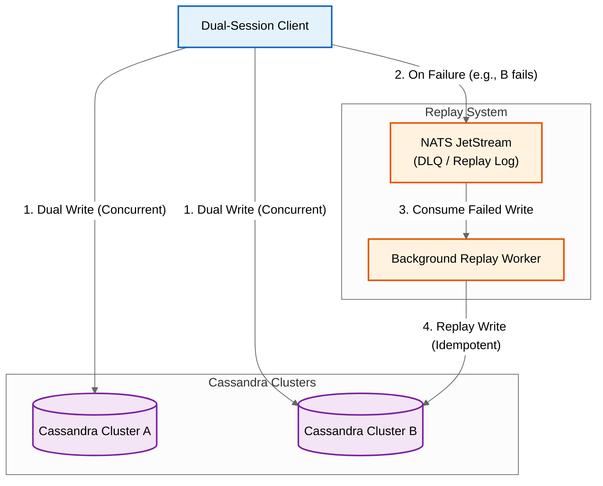

# Helix

[](https://pkg.go.dev/github.com/arloliu/helix)
[](https://goreportcard.com/report/github.com/arloliu/helix)

**Helix** is a high-availability dual-database client library for Go, designed to support "Shared Nothing" architecture with active-active dual writes, sticky reads, and asynchronous reconciliation.

## Features

- **Dual Active-Active Writes** - Concurrent writes to two independent clusters for maximum availability
- **Sticky Read Routing** - Per-client sticky reads to maximize cache hits across clusters
- **Active Failover** - Immediate failover to secondary cluster on read failures
- **Replay System** - Asynchronous reconciliation via in-memory queue or NATS JetStream
- **Drop-in Replacement** - Interface-based design mirrors `gocql` API for minimal migration effort
- **SQL Support** - Simple wrapper for `database/sql` with dual-write semantics

## Installation

```bash
go get github.com/arloliu/helix
```

## Quick Start

### CQL (Cassandra/ScyllaDB)

```go
package main

import (
    "log"
    "time"

    "github.com/arloliu/helix"
    v1 "github.com/arloliu/helix/adapter/cql/v1"
    "github.com/arloliu/helix/policy"
    "github.com/arloliu/helix/replay"
    "github.com/gocql/gocql"
)

func main() {
    // Create gocql sessions for both clusters
    clusterA := gocql.NewCluster("cluster-a.example.com")
    clusterA.Keyspace = "myapp"
    sessionA, _ := clusterA.CreateSession()
    defer sessionA.Close()

    clusterB := gocql.NewCluster("cluster-b.example.com")
    clusterB.Keyspace = "myapp"
    sessionB, _ := clusterB.CreateSession()
    defer sessionB.Close()

    // Create Helix client
    client, err := helix.NewCQLClient(
        v1.NewSession(sessionA),
        v1.NewSession(sessionB),
        helix.WithReplayer(replay.NewMemoryReplayer()),
        helix.WithReadStrategy(policy.NewStickyRead()),
        helix.WithWriteStrategy(policy.NewConcurrentDualWrite()),
        helix.WithFailoverPolicy(policy.NewActiveFailover()),
    )
    if err != nil {
        log.Fatal(err)
    }
    defer client.Close()

    // Dual-write to both clusters
    err = client.Query(
        "INSERT INTO users (id, name, email) VALUES (?, ?, ?)",
        gocql.TimeUUID(), "Alice", "alice@example.com",
    ).Exec()
    if err != nil {
        log.Printf("Both clusters failed: %v", err)
    }
    // If only one cluster failed, it's automatically queued for replay

    // Read with sticky routing and failover
    var name, email string
    err = client.Query(
        "SELECT name, email FROM users WHERE id = ?",
        userID,
    ).Scan(&name, &email)
}
```

### SQL (PostgreSQL, MySQL, etc.)

```go
package main

import (
    "database/sql"
    "log"

    "github.com/arloliu/helix"
    "github.com/arloliu/helix/replay"
    _ "github.com/lib/pq"
)

func main() {
    // Connect to both databases
    primary, _ := sql.Open("postgres", "host=primary.example.com ...")
    secondary, _ := sql.Open("postgres", "host=secondary.example.com ...")

    // Create Helix SQL client
    client, err := helix.NewSQLClientFromDB(primary, secondary,
        helix.WithReplayer(replay.NewMemoryReplayer()),
    )
    if err != nil {
        log.Fatal(err)
    }
    defer client.Close()

    // Dual-write
    _, err = client.Exec(
        "INSERT INTO users (id, name) VALUES ($1, $2)",
        "user-1", "Alice",
    )
}
```

## Architecture



## Strategies & Policies

### Write Strategies

| Strategy | Description |
|----------|-------------|
| `ConcurrentDualWrite` | Writes to both clusters concurrently (default) |
| `SyncDualWrite` | Writes sequentially (A then B, or B then A) |
| `AdaptiveDualWrite` | Latency-aware: healthy clusters wait, degraded clusters fire-and-forget |

### Read Strategies

| Strategy | Description |
|----------|-------------|
| `StickyRead` | Sticks to one cluster per client instance (default) |
| `PrimaryOnlyRead` | Always reads from Cluster A |
| `RoundRobinRead` | Alternates between clusters |

### Failover Policies

| Policy | Description |
|--------|-------------|
| `ActiveFailover` | Immediately tries secondary on failure (default) |
| `CircuitBreaker` | Switches after N consecutive failures |
| `LatencyCircuitBreaker` | CircuitBreaker + treats slow responses as soft failures |

See [Strategy & Policy Documentation](docs/strategy-policy.md) for detailed configuration and interaction patterns.

## Replay System

Helix provides two replay implementations for handling partial write failures:

| Implementation | Durability | Use Case |
|---------------|------------|----------|
| `MemoryReplayer` | Volatile | Development, testing |
| `NATSReplayer` | Durable | Production (requires NATS JetStream) |

See [Replay System Documentation](docs/replay-system.md) for detailed usage patterns.

## Configuration Options

### Production Recommendations

For production dual-cluster deployments, always configure:

| Component | Why It Matters |
|-----------|----------------|
| `Replayer` | **Critical**: Without a replayer, partial write failures are lost permanently. Use `NATSReplayer` for durability. |
| `ReadStrategy` | Improves read performance. `StickyRead` maximizes cache hits by routing reads to the same cluster. |
| `WriteStrategy` | Controls write behavior. `AdaptiveDualWrite` handles degraded clusters gracefully. |
| `FailoverPolicy` | Enables automatic read failover. `ActiveFailover` immediately retries on the secondary cluster. |

> **Warning**: A warning is logged if you create a dual-cluster client without a Replayer configured.

### Minimal Production Example

```go
client, err := helix.NewCQLClient(
    v1.NewSession(sessionA),
    v1.NewSession(sessionB),
    // REQUIRED for production: enables failure recovery
    helix.WithReplayer(replay.NewNATSReplayer(nc, nats.JetStreamContext(nc))),
    helix.WithReplayWorker(replay.NewWorker(replayer)),

    // RECOMMENDED: optimizes read/write behavior
    helix.WithReadStrategy(policy.NewStickyRead()),
    helix.WithWriteStrategy(policy.NewAdaptiveDualWrite()),
    helix.WithFailoverPolicy(policy.NewActiveFailover()),
)
```

### All Configuration Options

```go
helix.NewCQLClient(sessionA, sessionB,
    // Strategies
    helix.WithReadStrategy(policy.NewStickyRead(
        policy.WithStickyReadCooldown(5*time.Minute), // Prevent rapid cluster switching
    )),
    helix.WithWriteStrategy(policy.NewConcurrentDualWrite()),
    helix.WithFailoverPolicy(policy.NewActiveFailover()),

    // Replay
    helix.WithReplayer(replayer),
    helix.WithReplayWorker(worker),  // Optional: auto-start worker

    // Timestamps (critical for idempotency)
    helix.WithTimestampProvider(func() int64 {
        return time.Now().UnixMicro()
    }),
)
```

## Examples

See the [examples](examples/) directory:

- [basic](examples/basic/) - Simple dual-write and read operations
- [failover](examples/failover/) - Failover behavior demonstration
- [custom-strategy](examples/custom-strategy/) - Creating custom strategies
- [replay](examples/replay/) - Replay system usage

## Documentation

- [Replay System](docs/replay-system.md) - Replay patterns and best practices
- [Strategy & Policy](docs/strategy-policy.md) - Read/write strategies and failover policies

## Requirements

- Go 1.25+
- For CQL: v1: `github.com/gocql/gocql` or v2: `github.com/apache/cassandra-gocql-driver`
- For NATS Replay: `github.com/nats-io/nats.go`

## License

MIT License - see [LICENSE](LICENSE) for details.
