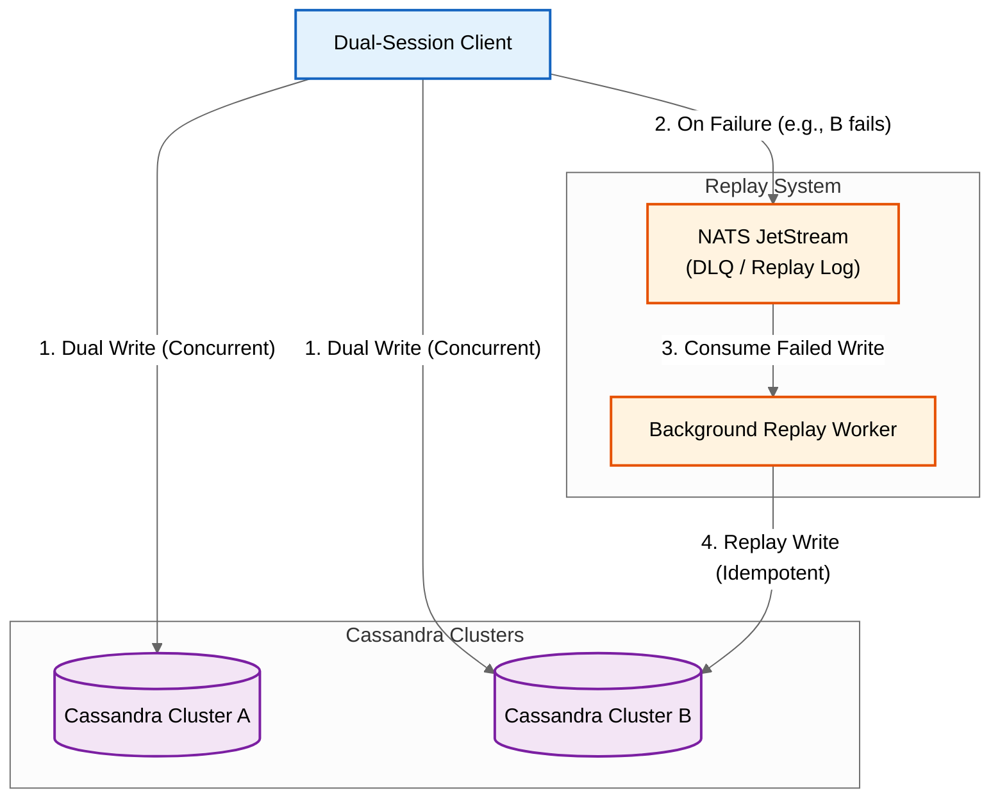

# Helix

[](https://pkg.go.dev/github.com/arloliu/helix)
[](https://goreportcard.com/report/github.com/arloliu/helix)

<div align="center">
  
</div>

**Helix** is a high-availability dual-database client library for Go, designed to support "Shared Nothing" architecture with active-active dual writes, sticky reads, and asynchronous reconciliation.

## Why "Helix"?

**Biomimetic Fault Tolerance.**

Helix is named after the DNA double helix: **two independent strands carrying the same genetic code.**

In this architecture, your database clusters are the strands. They share nothing—no state, no gossip, no master-slave tether. They exist in parallel universes.
*   **Dual Writes** replicate the code to both strands simultaneously.
*   **Sticky Reads** latch onto a single strand for maximum locality.
*   **Replay** acts as the **repair enzyme**, asynchronously healing "mutations" (inconsistencies) when a strand temporarily fails.

If one strand snaps, the other keeps the organism alive. It's 4 billion years of evolution applied to high-availability engineering. 🧬

## Features

- **Dual Active-Active Writes** - Concurrent writes to two independent clusters for maximum availability
- **Sticky Read Routing** - Per-client sticky reads to maximize cache hits across clusters
- **Active Failover** - Immediate failover to secondary cluster on read failures
- **Replay System** - Asynchronous reconciliation via in-memory queue or NATS JetStream
- **Strict Writes** - Per-statement opt-in for replay-unsafe writes (counters, list/set append) that surfaces partial failures immediately — see [Strict Write Guide](docs/strict-write.md)
- **Async Mirror Writes** - Per-statement `Mirror()` opt-in for seamless cluster migrations; async fire-and-forget with durable replay retry and optional out-of-process publisher mode — see [Mirror Guide](docs/mirror.md)
- **Session Refresh** - Manual or automatic recovery from permanently-dead sessions (cluster restart with port reassignment, DNS rotation) without rebuilding the client — see [Session Refresh Guide](docs/session-refresh.md)
- **Cluster Event Notification** - Single `WithOnClusterEvent` hook delivers typed alerts for failover, circuit breaker trips, adaptive-write degrade/recover, drain transitions, replay drops, and session refresh — see [Cluster Events Guide](docs/cluster-events.md)
- **Drop-in Replacement** - Interface-based design mirrors `gocql` API for minimal migration effort

> **CAS/LWT Warning:** Lightweight Transactions (`INSERT ... IF NOT EXISTS`, `ScanCAS`, etc.) are **not safe** in a shared-nothing dual-cluster architecture. Each cluster has an independent Paxos state, so CAS conditions cannot be coordinated across clusters. Do not use Helix for CAS/LWT operations.

## Installation

```bash
go get github.com/arloliu/helix
```

## Quick Start

### CQL (Cassandra/ScyllaDB)

```go
package main

import (
    "log"
    "time"

    "github.com/arloliu/helix"
    v1 "github.com/arloliu/helix/adapter/cql/v1"
    "github.com/arloliu/helix/policy"
    "github.com/arloliu/helix/replay"
    "github.com/gocql/gocql"
)

func main() {
    // Create gocql sessions for both clusters
    clusterA := gocql.NewCluster("cluster-a.example.com")
    clusterA.Keyspace = "myapp"
    sessionA, _ := clusterA.CreateSession()
    defer sessionA.Close()

    clusterB := gocql.NewCluster("cluster-b.example.com")
    clusterB.Keyspace = "myapp"
    sessionB, _ := clusterB.CreateSession()
    defer sessionB.Close()

    // Create Helix client
    client, err := helix.NewCQLClient(
        v1.NewSession(sessionA),
        v1.NewSession(sessionB),
        helix.WithReplayer(replay.NewMemoryReplayer()),
        helix.WithReadStrategy(policy.NewStickyRead()),
        helix.WithWriteStrategy(policy.NewConcurrentDualWrite()),
        helix.WithFailoverPolicy(policy.NewActiveFailover()),
    )
    if err != nil {
        log.Fatal(err)
    }
    defer client.Close()

    // Dual-write to both clusters
    err = client.Query(
        "INSERT INTO users (id, name, email) VALUES (?, ?, ?)",
        gocql.TimeUUID(), "Alice", "alice@example.com",
    ).Exec()
    if err != nil {
        log.Printf("Both clusters failed: %v", err)
    }
    // If only one cluster failed, it's automatically queued for replay

    // Read with sticky routing and failover
    var name, email string
    err = client.Query(
        "SELECT name, email FROM users WHERE id = ?",
        userID,
    ).Scan(&name, &email)
}
```

## Architecture


```mermaid
%%{init:{'theme':'neutral'}}%%
flowchart TD
    Client[Dual-Session Client]

    subgraph Clusters [Cassandra Clusters]
        CA[(Cassandra Cluster A)]
        CB[(Cassandra Cluster B)]
    end

    subgraph ReplaySys [Replay System]
        NATS["NATS JetStream<br/>(DLQ / Replay Log)"]
        Worker[Background Replay Worker]
    end

    %% Dual Write Path
    Client -- "1. Dual Write (Concurrent)" --> CA
    Client -- "1. Dual Write (Concurrent)" --> CB

    %% Failure Path
    Client -- "2. On Failure (e.g., B fails)" --> NATS

    %% Replay Path
    NATS -- "3. Consume Failed Write" --> Worker
    Worker -- "4. Replay Write (Idempotent)" --> CB

    classDef db fill:#e1f5fe,stroke:#01579b,stroke-width:2px;
    classDef component fill:#fff9c4,stroke:#fbc02d,stroke-width:2px;
    class CA,CB db;
    class NATS,Worker component;
    %% --- Stylesheet ---
    classDef app fill:#e3f2fd,stroke:#1565c0,stroke-width:2px,color:#000;
    classDef db fill:#f3e5f5,stroke:#7b1fa2,stroke-width:2px,color:#000;
    classDef infra fill:#fff3e0,stroke:#e65100,stroke-width:2px,color:#000;

    class Client app;
    class CA,CB db;
    class NATS,Worker infra;
```

## Strategies & Policies

### Write Strategies

| Strategy | Description |
|----------|-------------|
| `ConcurrentDualWrite` | Writes to both clusters concurrently (default) |
| `SyncDualWrite` | Writes sequentially (A then B, or B then A) |
| `AdaptiveDualWrite` | Latency-aware: healthy clusters wait, degraded clusters fire-and-forget |

### Read Strategies

| Strategy | Description |
|----------|-------------|
| `StickyRead` | Sticks to one cluster per client instance (default) |
| `PrimaryOnlyRead` | Always reads from Cluster A |
| `RoundRobinRead` | Alternates between clusters |

### Failover Policies

| Policy | Description |
|--------|-------------|
| `ActiveFailover` | Immediately tries secondary on failure (default) |
| `CircuitBreaker` | Switches after N consecutive failures |
| `LatencyCircuitBreaker` | CircuitBreaker + treats slow responses as soft failures |

See [Strategy & Policy Documentation](docs/strategy-policy.md) for detailed configuration and interaction patterns.

### FallbackRead

When a dual-write partially fails and replay hasn't converged yet, a read may return "not found" on one cluster even though the data exists on the other. FallbackRead silently checks both clusters before returning not-found.

```go
// Per-query: critical data only
err := client.Query("SELECT * FROM users WHERE id = ?", id).
    FallbackRead().Scan(&name)

// Per-context: all queries in a request handler
ctx := helix.WithFallbackRead(r.Context())
err = client.Query("SELECT ...").ScanContext(ctx, &dest)

// Per-client: all queries on this client
client, _ := helix.NewCQLClient(sessionA, sessionB,
    helix.WithDefaultFallbackRead(true),
)
```

Use `helix.IsNotFound(err)` to check results. See [FallbackRead Guide](docs/fallback-read.md) for availability semantics, activation levels, and best practices.

**Multi-row reads** — `SliceMap`, `SliceScan`, and `SliceScanAs[T]` collect all rows into memory and also participate in FallbackRead:

```go
rows, err := client.Query("SELECT * FROM orders WHERE user = ?", userID).
    FallbackRead().MaxRows(1_000).SliceMapContext(ctx)
```

See [Slice Read Guide](docs/slice-read.md) for all methods, `MaxRows` configuration, the typed `SliceScanAs[T]` helper, and performance notes.

## Cluster Event Notification

Register one handler to receive typed `types.ClusterEvent` notifications for
operationally significant transitions — failover, circuit breaker open/close,
adaptive-write degrade/recover, drain enter/exit, replay drops, and session
refresh:

```go
client, err := helix.NewCQLClient(sessionA, sessionB,
    // circuit_breaker_open comes from the failover policy, which is unset by
    // default — without this option the handler below is never called.
    helix.WithFailoverPolicy(policy.NewCircuitBreaker()),

    helix.WithOnClusterEvent(func(ev types.ClusterEvent) {
        if ev.Kind == types.EventCircuitBreakerOpen {
            alerting.Page("cluster degraded", "cluster", string(ev.Cluster))
        }
    }),
)
```

Which kinds you receive depends on what else you configure: most are produced
by an optional component and stay silent when it is absent. The constructor
logs one Info line listing any kinds left unreachable by the configuration.
The [Cluster Events Guide](docs/cluster-events.md) has a per-kind
prerequisites table, plus the full event reference, delivery/shutdown
semantics, and standalone policy usage.

## Duration Histograms (`contrib/metrics/vm`)

**Breaking — dashboard migration required.** The bundled collector now exposes
`*_duration_seconds` metrics as classic Prometheus histograms
(`_bucket{le=...}`, `_sum`, `_count`) instead of VictoriaMetrics-native
`vmrange` histograms. `histogram_quantile()` now works in vanilla Prometheus,
but existing `vmrange`-based quantile queries return no data and must be
rewritten against `le` buckets:

```promql
histogram_quantile(0.99, sum(rate(helix_read_duration_seconds_bucket[5m])) by (le))
```

Queries built on `_sum` and `_count` — average latency, throughput — are
unaffected; only quantile queries break. See the
[CHANGELOG](CHANGELOG.md) for the full entry.

## Replay System

Helix provides two replay implementations for handling partial write failures:

| Implementation | Durability | Use Case |
|---------------|------------|----------|
| `MemoryReplayer` | Volatile | Development, testing |
| `NATSReplayer` | Durable | Production (requires NATS JetStream) |

See [Replay System Documentation](docs/replay-system.md) for detailed usage patterns.

## Configuration Options

### Production Recommendations

For production dual-cluster deployments, always configure:

| Component | Why It Matters |
|-----------|----------------|
| `Replayer` | **Critical**: Without a replayer, partial write failures are lost permanently. Use `NATSReplayer` for durability. |
| `ReadStrategy` | Improves read performance. `StickyRead` maximizes cache hits by routing reads to the same cluster. |
| `WriteStrategy` | Controls write behavior. `AdaptiveDualWrite` handles degraded clusters gracefully. |
| `FailoverPolicy` | Enables automatic read failover. `ActiveFailover` immediately retries on the secondary cluster. |

> **Warning**: A warning is logged if you create a dual-cluster client without a Replayer configured.

### Minimal Production Example

```go
client, err := helix.NewCQLClient(
    v1.NewSession(sessionA),
    v1.NewSession(sessionB),
    // REQUIRED for production: enables failure recovery (in-memory, auto-started)
    helix.WithAutoMemoryWorker(10000),

    // RECOMMENDED: optimizes read/write behavior
    helix.WithReadStrategy(policy.NewStickyRead()),
    helix.WithWriteStrategy(policy.NewAdaptiveDualWrite()),
    helix.WithFailoverPolicy(policy.NewActiveFailover()),
)
```

For durable replay across restarts, use a NATS-backed replayer instead:

```go
natsReplayer, err := replay.NewNATSReplayer(js) // js is jetstream.JetStream
if err != nil {
    log.Fatal(err)
}
client, err := helix.NewCQLClient(
    v1.NewSession(sessionA),
    v1.NewSession(sessionB),
    helix.WithReplayer(natsReplayer),
    helix.WithReplayWorker(replay.NewNATSWorker(natsReplayer, executorFunc)),
    helix.WithReadStrategy(policy.NewStickyRead()),
    helix.WithWriteStrategy(policy.NewAdaptiveDualWrite()),
    helix.WithFailoverPolicy(policy.NewActiveFailover()),
)
```

### All Configuration Options

`NewCQLClient` validates root options before starting background components or
mutating caller-owned strategies, policies, and workers. Invalid root options
return joined `*types.OptionError` values that can be checked with
`types.IsOptionError` or `errors.As`; mirror mode conflicts also wrap the
relevant sentinel error such as `types.ErrMirrorModeConflict`.

```go
helix.NewCQLClient(sessionA, sessionB,
    // Strategies
    helix.WithReadStrategy(policy.NewStickyRead(
        policy.WithStickyReadCooldown(5*time.Minute), // Prevent rapid cluster switching
    )),
    helix.WithWriteStrategy(policy.NewConcurrentDualWrite()),
    helix.WithFailoverPolicy(policy.NewActiveFailover()),

    // Replay
    helix.WithReplayer(replayer),
    helix.WithReplayWorker(worker),  // Optional: auto-start worker

    // Timestamps (critical for idempotency)
    helix.WithTimestampProvider(func() int64 {
        return time.Now().UnixMicro()
    }),

    // Mirror — async per-statement mirroring to a second cluster pair (cluster migrations)
    helix.WithMirror(mirrorClient),
    helix.WithMirrorReplayer(replayer),           // durable retry for failed mirror writes
    // helix.WithMirrorPublisher(natsReplayer),   // out-of-process publisher mode

    // Recovery probe — auto-heal degraded clusters (default-on with AdaptiveDualWrite)
    helix.WithRecoveryProbe(helix.RecoveryProbe{
        Interval: 5 * time.Second,
        Timeout:  2 * time.Second,
    }),
    // helix.WithRecoveryProbeDisabled(),  // opt out; use ForceRecover() manually

    // Session refresh — recover from permanently-dead sessions
    // (cluster restart with port reassignment, DNS rotation) without
    // rebuilding the client. See docs/session-refresh.md.
    helix.WithSessionRefresher(func(ctx context.Context, cluster helix.ClusterID, lastErr error) (cql.Session, error) {
        // Caller code: rebuild gocql session against the cluster's
        // current endpoint, wrapped with the v1/v2 adapter.
        return v1.NewSession(rebuildGocqlSession(cluster)), nil
    }),
    helix.WithAutoRefresh(),  // Helix-driven refresh on observed dead session
)
```

## Examples

See the [examples](examples/) directory:

- [basic](examples/basic/) - Simple dual-write and read operations
- [failover](examples/failover/) - Failover behavior demonstration
- [custom-strategy](examples/custom-strategy/) - Creating custom strategies
- [replay](examples/replay/) - Replay system usage
- [mirror](examples/mirror/) - Async mirror write wiring for cluster migrations

## Documentation

- [Strategy & Policy](docs/strategy-policy.md) — Read/write strategies, failover policies, and `AllowedClusters` operator override
- [Replay System](docs/replay-system.md) — Queue implementations, replay patterns, and worker configuration
- [AdaptiveDualWrite Guide](docs/adaptive-dual-write.md) — Latency-aware write strategy: degradation thresholds, fire-and-forget, and recovery probe
- [Slice Read Guide](docs/slice-read.md) — Bounded multi-row reads: `SliceMap`, `SliceScan`, `MaxRows`, and `SliceScanAs[T]`
- [FallbackRead Guide](docs/fallback-read.md) — Best-effort dual-cluster reads for critical read-after-write scenarios
- [Strict Write Guide](docs/strict-write.md) — Replay-unsafe writes: counters, list/set append, tombstone races
- [Mirror Guide](docs/mirror.md) — Async per-statement mirroring for seamless cluster migrations
- [Auto-Recovery Guide](docs/auto-recovery.md) — Recovery lifecycle, coordinated drain / re-enable workflow, and operator best practices
- [Session Refresh Guide](docs/session-refresh.md) — Recover from permanently-dead sessions without rebuilding the client
- [Cluster Events Guide](docs/cluster-events.md) — `WithOnClusterEvent` notification hook: event reference, delivery/shutdown semantics, standalone policy usage
- [Simulation Guide](docs/simulation_guide.md) — Behavioral test harness for multi-cluster failure scenarios

## Requirements

- Go 1.26+
- For CQL: v1: `github.com/gocql/gocql` or v2: `github.com/apache/cassandra-gocql-driver`
- Helix builds the v2 adapter against the `arloliu/cassandra-gocql-driver` fork (tag `v2.3.1-otter`)
  through a `replace` directive.
  Go ignores `replace` in dependencies, so a module that uses the v2 adapter must add the same
  line to its own `go.mod`:

  ```
  replace github.com/apache/cassandra-gocql-driver/v2 => github.com/arloliu/cassandra-gocql-driver/v2 v2.3.1-otter
  ```

  The fork lets a caller's context deadline override the connection-level request timeout, so a read
  leg is no longer capped by `Session.Timeout`. Set `helix.WithClusterReadTimeout(d)` to bound each
  leg yourself; without it the first cluster can consume the caller's whole budget and read
  failover never reaches the second cluster. Size `d` by how long a healthy cluster may take to
  answer, then give callers at least `2*d` so both legs can have their full allowance. Where a leg
  may hit the driver's reconnect path it returns on the driver's request timeout `r` instead of on
  `d`, so a caller that must survive that case needs about `r + d`, not `max(2*d, r)`.

  Give writes a caller deadline longer than the driver's own request timeout as well. A write to an
  unreachable node returns on that timeout even when the context is already cancelled, and a leg
  that finishes after the caller's deadline is attributed to the caller rather than to the cluster:
  no health failure is recorded, so `AdaptiveDualWrite` does not degrade the cluster. That is
  enough for the strategies that run both legs together; `policy.SyncDualWrite` runs them one
  after another and skips the second once the context has ended, so budget it like a read: about
  `r + d`.
- For NATS Replay: `github.com/nats-io/nats.go`

## License

MIT License - see [LICENSE](LICENSE) for details.
