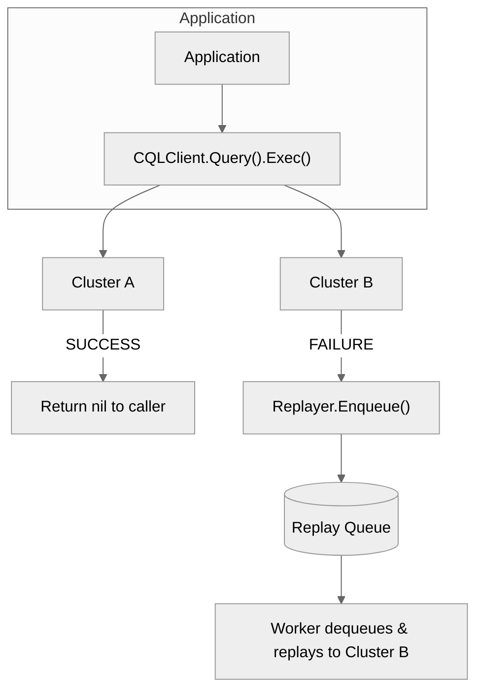
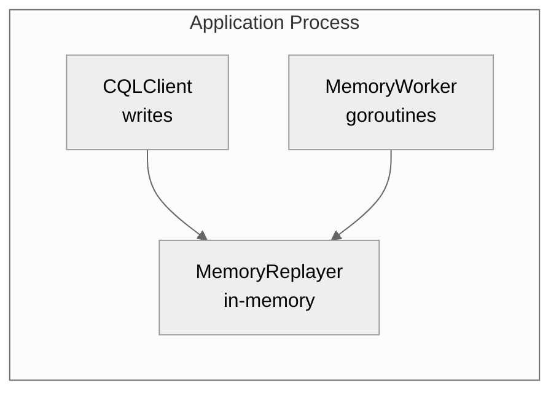
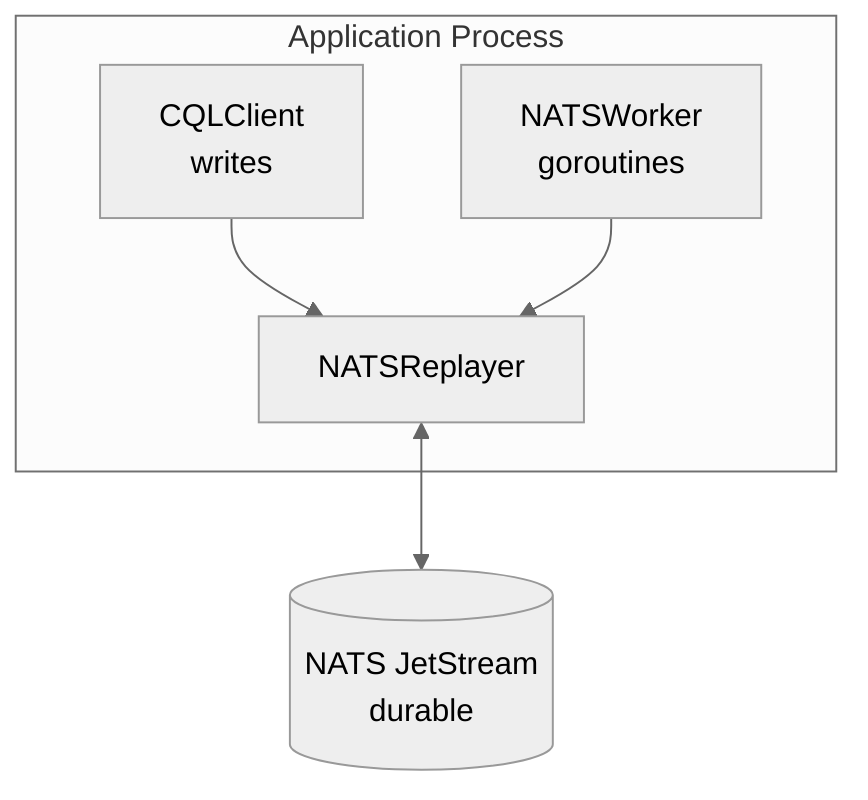
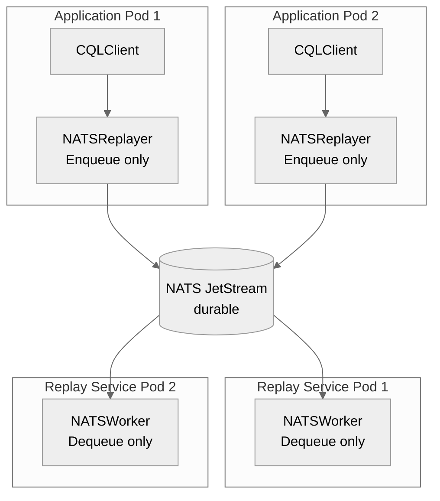

# Helix Replay System

The Helix Replay System provides **asynchronous reconciliation** for partial write failures in dual-cluster deployments. When a write succeeds on one cluster but fails on another, the failed write is enqueued for later replay.

## Quick Reference: Replayer vs ReplayWorker

| Component | Purpose | Config Option | Required? |
|-----------|---------|---------------|-----------|
| **Replayer** | **Queue** - stores failed writes | `WithReplayer()` | Yes, for production |
| **ReplayWorker** | **Consumer** - processes the queue | `WithReplayWorker()` | Optional* |

**In simple terms:**
- `Replayer` = "Where do I put failed writes?" (the queue)
- `ReplayWorker` = "Who processes the queue?" (the consumer)

**\*When to use each:**

```go
// Development: Both in same process (simple)
client, _ := helix.NewCQLClient(sessionA, sessionB,
    helix.WithReplayer(replayer),       // Queue
    helix.WithReplayWorker(worker),     // Consumer (auto-starts)
)

// Production microservices: Separate processes
// App instances: Only the queue
client, _ := helix.NewCQLClient(sessionA, sessionB,
    helix.WithReplayer(replayer),       // Queue only
    // No worker - handled by dedicated replay service
)
```

See [Deployment Patterns](#deployment-patterns) for detailed examples.

---

## Overview



## Components

### Replayer (Queue Interface)

The `Replayer` interface abstracts the message queue:

```go
type Replayer interface {
    Enqueue(ctx context.Context, payload ReplayPayload) error
}
```

**Implementations:**

| Implementation | Durability | Use Case |
|---------------|------------|----------|
| `MemoryReplayer` | Volatile (lost on crash) | Development, testing |
| `NATSReplayer` | Durable (persisted) | Production |

### Replay Worker (Consumer)

The `Worker` consumes messages from the queue and executes them against the target cluster:

```go
type ReplayWorker interface {
    Start() error
    Stop()
    IsRunning() bool
}
```

**Implementations:**

| Implementation | Processing Model | Use Case |
|---------------|------------------|----------|
| `MemoryWorker` | Single goroutine | Paired with MemoryReplayer |
| `NATSWorker` | One goroutine per cluster | Paired with NATSReplayer |

---

## Deployment Patterns

### Pattern 1: Embedded Worker (Development/Simple Deployments)

The worker runs in the same process as the application. This is the simplest setup but offers limited durability.



**Code Example (Recommended - using DefaultExecuteFunc):**

```go
package main

import (
    "log"
    "time"

    "github.com/arloliu/helix"
    "github.com/arloliu/helix/replay"
)

func main() {
    // Create sessions for both clusters
    sessionA := createSession("cluster-a.example.com")
    sessionB := createSession("cluster-b.example.com")

    // Create in-memory replayer
    replayer := replay.NewMemoryReplayer(
        replay.WithQueueCapacity(10000),
    )

    // Create client first (needed for DefaultExecuteFunc)
    client, err := helix.NewCQLClient(sessionA, sessionB,
        helix.WithReplayer(replayer),
    )
    if err != nil {
        log.Fatal(err)
    }

    // Create worker using DefaultExecuteFunc - automatically routes
    // replays to the correct cluster and preserves timestamps
    worker := replay.NewMemoryWorker(replayer, client.DefaultExecuteFunc(),
        replay.WithPollInterval(100*time.Millisecond),
        replay.WithExecuteTimeout(30*time.Second),
    )

    // Attach worker to client for automatic lifecycle management
    client.SetReplayWorker(worker)
    defer client.Close() // Stops worker and closes sessions

    // Use client normally
    err = client.Query("INSERT INTO users (id, name) VALUES (?, ?)",
        "user-1", "Alice").Exec()
    if err != nil {
        log.Printf("Both clusters failed: %v", err)
    }
    // If only one cluster failed, err is nil and replay is enqueued
}
```

**When to use:**
- Development and testing
- Single-instance deployments
- When message loss on crash is acceptable

**Limitations:**
- Messages lost if application crashes
- No horizontal scaling of replay processing

---

### Pattern 2: NATS with Embedded Worker

Durable queue with NATS JetStream, worker still in same process:



**Code Example:**

```go
package main

import (
    "log"
    "time"

    "github.com/nats-io/nats.go"
    "github.com/nats-io/nats.go/jetstream"

    "github.com/arloliu/helix"
    "github.com/arloliu/helix/replay"
    "github.com/arloliu/helix/types"
)

func main() {
    // Connect to NATS
    nc, err := nats.Connect("nats://localhost:4222")
    if err != nil {
        log.Fatal(err)
    }
    defer nc.Close()

    // Create JetStream context
    js, err := jetstream.New(nc)
    if err != nil {
        log.Fatal(err)
    }

    // Create sessions
    sessionA := createSession("cluster-a.example.com")
    sessionB := createSession("cluster-b.example.com")

    // Create NATS replayer (durable)
    replayer, err := replay.NewNATSReplayer(js,
        replay.WithStreamName("helix-replay"),
        replay.WithSubjectPrefix("helix.replay"),
        replay.WithMaxAge(24*time.Hour),        // Retain for 24 hours
        replay.WithMaxMsgs(1_000_000),          // Max 1M messages
        replay.WithReplicas(3),                 // 3-way replication
    )
    if err != nil {
        log.Fatal(err)
    }
    defer replayer.Close()

    // Create client first (needed for DefaultExecuteFunc)
    client, err := helix.NewCQLClient(sessionA, sessionB,
        helix.WithReplayer(replayer),
    )
    if err != nil {
        log.Fatal(err)
    }

    // Create NATS worker using DefaultExecuteFunc
    worker := replay.NewNATSWorker(replayer, client.DefaultExecuteFunc(),
        replay.WithBatchSize(100),
        replay.WithPollInterval(500*time.Millisecond),
        replay.WithExecuteTimeout(30*time.Second),
        replay.WithOnSuccess(func(p types.ReplayPayload) {
            log.Printf("Replay succeeded: cluster=%s query=%s",
                p.TargetCluster, p.Query)
        }),
        replay.WithOnError(func(p types.ReplayPayload, err error, attempt int) {
            log.Printf("Replay failed: cluster=%s attempt=%d err=%v",
                p.TargetCluster, attempt, err)
        }),
    )

    // Attach worker to client
    client.SetReplayWorker(worker)
    defer client.Close()

    // Use client...
}
```

**When to use:**
- Small to medium deployments
- When you need durability but not dedicated replay infrastructure
- Single-tenant applications

**Limitations:**
- Worker lifecycle tied to application
- Limited horizontal scaling

---

### Using DefaultExecuteFunc

The `client.DefaultExecuteFunc()` method provides a convenient way to create the execute function
for replay workers. It automatically handles:

- **Routing**: Directs replays to the correct cluster (A or B) based on `payload.TargetCluster`
- **Batch Operations**: Properly handles batch payloads with correct `BatchType`
- **Timestamp Preservation**: Applies the original write timestamp for idempotency
- **Context Handling**: Respects context cancellation and timeouts

**When to use DefaultExecuteFunc:**
- All patterns (embedded worker or dedicated service)
- When you want the simplest setup with automatic routing

**When NOT to use DefaultExecuteFunc:**
- When you need custom logic (transformations, filtering, custom metrics per query)
- When you want to use raw `gocql.Session` without helix adapters

---

### Pattern 3: Dedicated Replay Service (Production Recommended)

For production deployments, run the replay worker as a **separate service**:



**Application Code (Enqueue Only):**

```go
// cmd/app/main.go
package main

import (
    "log"

    "github.com/nats-io/nats.go"
    "github.com/nats-io/nats.go/jetstream"

    "github.com/arloliu/helix"
    "github.com/arloliu/helix/replay"
)

func main() {
    nc, _ := nats.Connect("nats://nats.example.com:4222")
    defer nc.Close()

    js, _ := jetstream.New(nc)

    sessionA := createSession("cluster-a.example.com")
    sessionB := createSession("cluster-b.example.com")

    // Create replayer - NO WORKER
    replayer, _ := replay.NewNATSReplayer(js,
        replay.WithStreamName("helix-replay"),
    )
    defer replayer.Close()

    // Create client with replayer only (no worker)
    client, _ := helix.NewCQLClient(sessionA, sessionB,
        helix.WithReplayer(replayer),
        // NOTE: No WithReplayWorker - handled by separate service
    )
    defer client.Close()

    // Application logic...
    // Failed writes are enqueued but processed by the replay service
}
```

**Replay Service Code (Dequeue Only):**

```go
// cmd/replay-service/main.go
package main

import (
    "log"
    "os"
    "os/signal"
    "syscall"
    "time"

    "github.com/nats-io/nats.go"
    "github.com/nats-io/nats.go/jetstream"

    "github.com/arloliu/helix"
    "github.com/arloliu/helix/replay"
    "github.com/arloliu/helix/types"
)

func main() {
    // Connect to NATS
    nc, err := nats.Connect("nats://nats.example.com:4222")
    if err != nil {
        log.Fatal(err)
    }
    defer nc.Close()

    js, _ := jetstream.New(nc)

    // Create sessions to both clusters
    sessionA := createSession("cluster-a.example.com")
    sessionB := createSession("cluster-b.example.com")

    // Create replayer (same config as application)
    replayer, err := replay.NewNATSReplayer(js,
        replay.WithStreamName("helix-replay"),
    )
    if err != nil {
        log.Fatal(err)
    }
    defer replayer.Close()

    // Create a CQLClient to get DefaultExecuteFunc
    // Note: This client is only used for replay execution, not for writes
    client, err := helix.NewCQLClient(sessionA, sessionB)
    if err != nil {
        log.Fatal(err)
    }
    defer client.Close()

    // Create worker with DefaultExecuteFunc and callbacks for observability
    worker := replay.NewNATSWorker(replayer, client.DefaultExecuteFunc(),
        replay.WithBatchSize(100),
        replay.WithPollInterval(500*time.Millisecond),
        replay.WithOnSuccess(func(p types.ReplayPayload) {
            metrics.ReplaySuccessTotal.Inc()
            log.Printf("Replay OK: cluster=%s", p.TargetCluster)
        }),
        replay.WithOnError(func(p types.ReplayPayload, err error, attempt int) {
            metrics.ReplayErrorTotal.Inc()
            log.Printf("Replay FAIL: cluster=%s attempt=%d err=%v",
                p.TargetCluster, attempt, err)
        }),
        replay.WithOnDrop(func(p types.ReplayPayload, err error) {
            metrics.ReplayDropTotal.Inc()
            log.Printf("Replay DROPPED: cluster=%s query=%s err=%v",
                p.TargetCluster, p.Query, err)
        }),
    )

    // Start worker
    if err := worker.Start(); err != nil {
        log.Fatal(err)
    }

    log.Println("Replay service started, waiting for messages...")

    // Wait for shutdown signal
    sigCh := make(chan os.Signal, 1)
    signal.Notify(sigCh, syscall.SIGINT, syscall.SIGTERM)
    <-sigCh

    log.Println("Shutting down...")
    worker.Stop()
    log.Println("Replay service stopped")
}
```

**When to use:**
- Production deployments
- Multi-tenant or high-throughput systems
- When you need independent scaling of replay processing
- When you need isolation between application and replay logic

**Benefits:**
- **Horizontal scaling**: Add more replay service pods independently
- **Isolation**: Replay failures don't affect main application
- **Resource management**: Dedicate CPU/memory to replay processing
- **Resilience**: Application can crash, messages persist, replay continues
- **Observability**: Centralized metrics and logging for replay operations

---

## Configuration Reference

### MemoryReplayer Options

| Option | Default | Description |
|--------|---------|-------------|
| `WithQueueCapacity(n)` | 10,000 | Total capacity shared across high/low priority queues |
| `WithMemoryHighPriorityRatio(n)` | 10 | Process N high-priority items before 1 low-priority |
| `WithMemoryStrictPriority(bool)` | false | Drain all high-priority before any low-priority |

### NATSReplayer Options

| Option | Default | Description |
|--------|---------|-------------|
| `WithStreamName(s)` | `"helix-replay"` | JetStream stream name |
| `WithSubjectPrefix(s)` | `"helix.replay"` | Subject prefix for messages |
| `WithMaxAge(d)` | 24 hours | Message retention period |
| `WithMaxMsgs(n)` | 1,000,000 | Maximum messages in stream |
| `WithMaxBytes(n)` | 1 GB | Maximum stream size |
| `WithReplicas(n)` | 1 | Replication factor (use 3 for production) |
| `WithPublishTimeout(d)` | 5s | Publish timeout |
| `WithMaxAckPending(n)` | 1000 | Max unacked messages per consumer (backpressure) |
| `WithMaxRequestBatch(n)` | 100 | Max batch size per pull request |
| `WithAckWait(d)` | 30s | Time before unacked message is redelivered |

### Worker Options

| Option | Default | Description |
|--------|---------|-------------|
| `WithBatchSize(n)` | 100 | Messages per dequeue |
| `WithPollInterval(d)` | 100ms | Polling interval when idle |
| `WithRetryDelay(d)` | 100ms | Initial retry delay |
| `WithMaxRetryDelay(d)` | 30s | Maximum retry delay |
| `WithExecuteTimeout(d)` | 30s | Timeout per replay execution |
| `WithHighPriorityRatio(n)` | 10 | Process N high-priority batches before 1 low-priority |
| `WithStrictPriority(bool)` | false | Drain all high-priority before any low-priority |
| `WithWorkerMetrics(m)` | nil | Metrics collector for statistics |
| `WithWorkerLogger(l)` | nil | Structured logger for events |
| `WithWorkerClusterNames(n)` | A/B | Custom cluster display names |
| `WithOnSuccess(fn)` | nil | Callback on successful replay |
| `WithOnError(fn)` | nil | Callback on failed replay |
| `WithOnDrop(fn)` | nil | Callback when message dropped |

---

## Best Practices

### 1. Avoid Counter Operations with Replay

**WARNING**: Counter operations (e.g., `UPDATE ... SET counter = counter + 1`) are **NOT idempotent**.

The Replay System relies on client-generated timestamps for idempotency, but counter updates are additive - they don't use timestamps for conflict resolution. If a counter update succeeds on Cluster A but times out on Cluster B (while actually succeeding), the replay will increment B again, causing **double-counting**.

**Alternatives for counters:**
- Use single-cluster mode for counter tables
- Implement application-level deduplication using unique operation IDs
- Use a separate reconciliation strategy that compares counter values between clusters

### 2. Always Set Timestamps

Helix automatically sets timestamps on all writes. This ensures **idempotency** during replay - replaying a write won't overwrite newer data.

```go
// Helix sets this automatically, but you can override:
client.Query("INSERT INTO users (id, name) VALUES (?, ?)", id, name).
    WithTimestamp(time.Now().UnixMicro()).
    Exec()
```

### 2. Monitor Replay Queue Depth

For production, monitor the NATS stream to detect replay backlogs:

```bash
# Check stream info
nats stream info helix-replay

# Watch message counts
nats stream info helix-replay --json | jq '.state.messages'
```

### 3. Set Appropriate Retention

Configure retention based on your recovery requirements:

```go
replay.NewNATSReplayer(js,
    replay.WithMaxAge(24*time.Hour),    // Keep for 24 hours
    replay.WithMaxMsgs(1_000_000),      // Or max 1M messages
)
```

### 4. Handle Poison Messages

Messages that consistently fail will be redelivered up to NATS's `MaxDeliver` limit. Use `OnDrop` callback to handle these:

```go
replay.NewNATSWorker(replayer, executeFunc,
    replay.WithOnDrop(func(p types.ReplayPayload, err error) {
        // Log for investigation
        log.Printf("Poison message dropped: %+v", p)

        // Send to dead letter queue
        deadLetterQueue.Enqueue(p)

        // Alert operations team
        alerting.SendAlert("Replay message dropped", p, err)
    }),
)
```

### 5. Use Priority Levels

Helix supports two priority levels for replay operations:

```go
// High priority (default) - critical writes, processed first
client.Query("INSERT INTO orders ...").
    WithPriority(helix.PriorityHigh).
    Exec()

// Low priority - best-effort writes, processed after high priority
client.Query("INSERT INTO analytics ...").
    WithPriority(helix.PriorityLow).
    Exec()

// Batches also support priority
client.Batch(helix.LoggedBatch).
    Query("INSERT ...").
    WithPriority(helix.PriorityLow).
    Exec()
```

**Priority Processing Modes:**

| Mode | Description | Use Case |
|------|-------------|----------|
| **Ratio-based (default)** | Process N high-priority batches, then 1 low-priority | Fair scheduling with priority preference |
| **Strict priority** | Drain all high-priority before any low-priority | Absolute priority (may starve low) |

**Configure worker priority behavior:**

```go
// Default: 10:1 ratio (process 10 high-priority batches, then 1 low-priority)
worker := replay.NewMemoryWorker(replayer, executeFunc,
    replay.WithHighPriorityRatio(10),   // Default
    replay.WithStrictPriority(false),   // Default
)

// Strict priority mode: high must be empty before processing low
worker := replay.NewMemoryWorker(replayer, executeFunc,
    replay.WithStrictPriority(true),
)

// Equal priority (1:1 ratio)
worker := replay.NewMemoryWorker(replayer, executeFunc,
    replay.WithHighPriorityRatio(0),
)
```

**Starvation Prevention:**

The default ratio-based scheduling ensures low-priority messages are eventually processed even under continuous high-priority load. For every 10 high-priority batches processed, 1 low-priority batch is processed.

The NATS replayer uses separate subjects per priority (`helix.replay.high.A`, `helix.replay.low.B`), enabling independent monitoring and processing.

---

## Troubleshooting

### Messages Not Being Processed

1. **Check worker is running:**
   ```go
   if !worker.IsRunning() {
       worker.Start()
   }
   ```

2. **Check NATS connectivity:**
   ```bash
   nats server ping
   ```

3. **Check stream exists:**
   ```bash
   nats stream ls
   ```

### High Replay Latency

1. **Increase batch size:**
   ```go
   replay.WithBatchSize(100)
   ```

2. **Add more worker instances** (dedicated service pattern)

3. **Check target cluster performance**

### Queue Growing Unbounded

1. **Check target cluster availability**
2. **Review error callbacks for failure patterns**
3. **Consider temporary rate limiting on writes**

---

## See Also

- [High Level Design](high_level_design.md) - Overall Helix architecture
- [Design Plan](design_plan.md) - Implementation phases
- [NATS JetStream Documentation](https://docs.nats.io/nats-concepts/jetstream)
