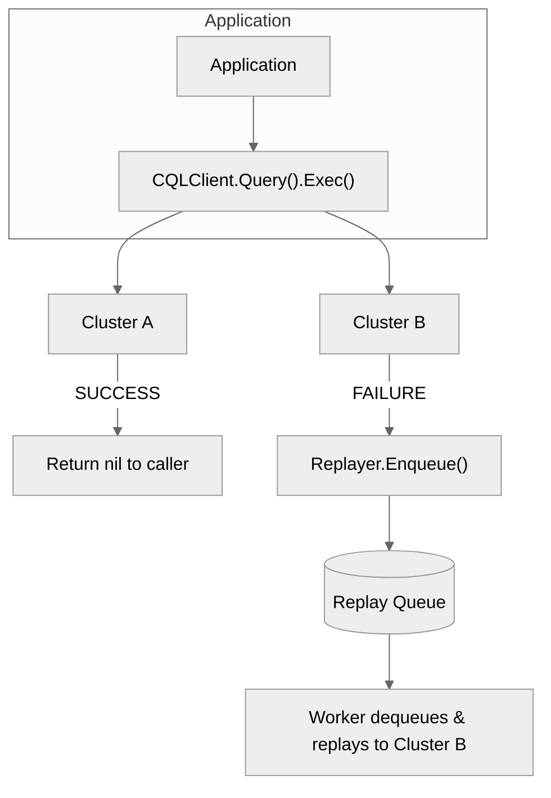
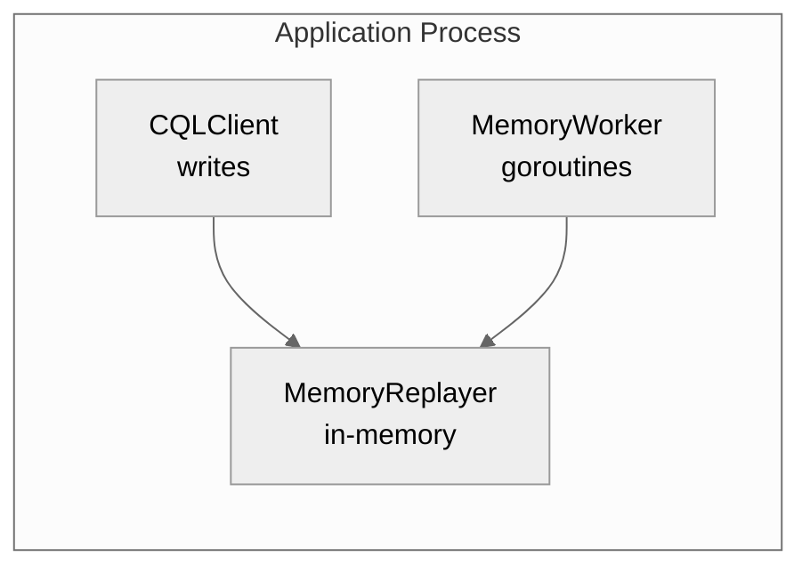
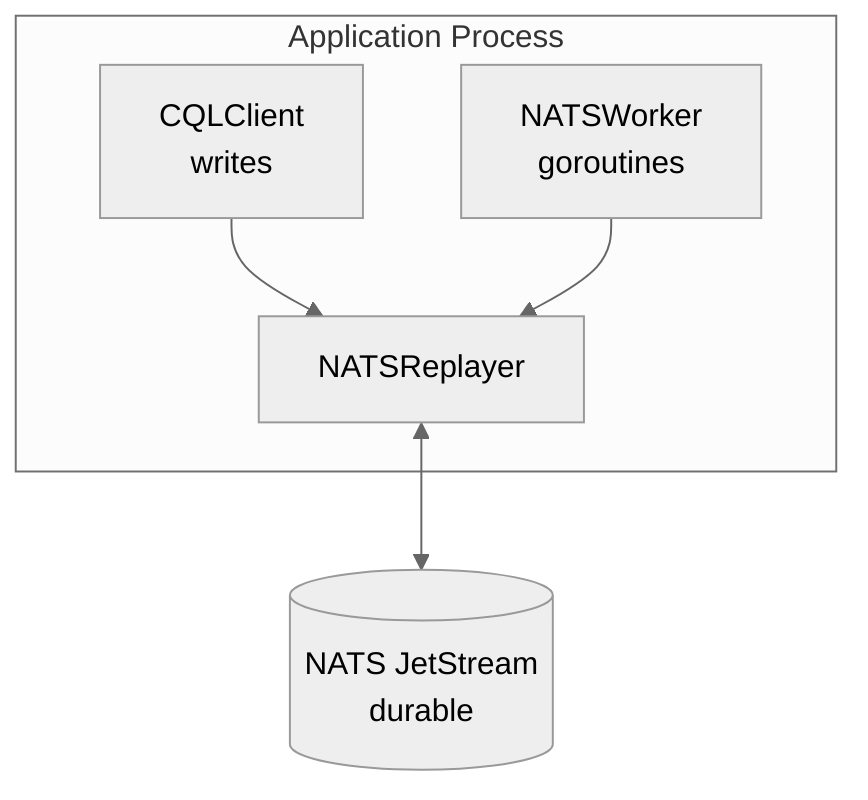
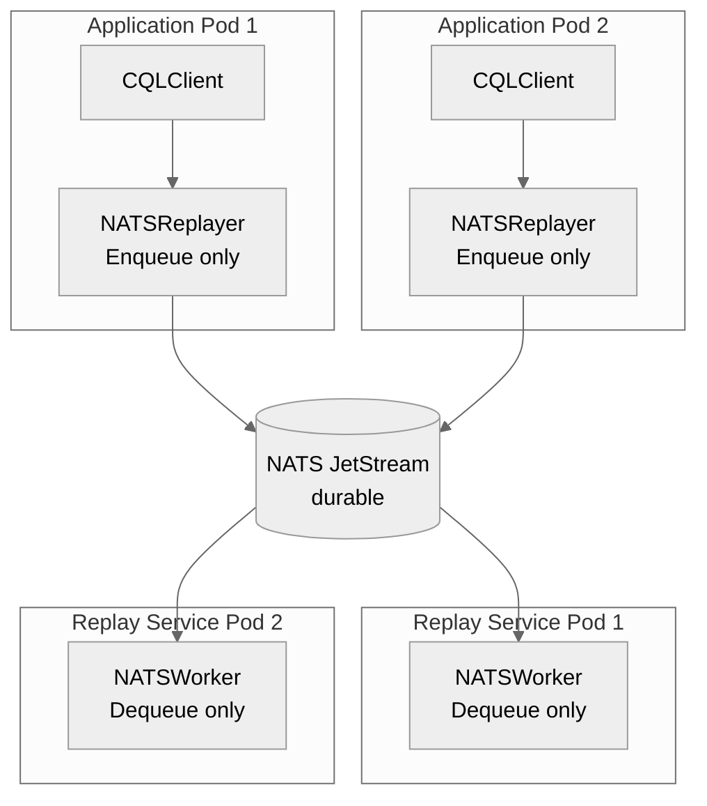

# Helix Replay System

The Helix Replay System provides **asynchronous reconciliation** for partial write failures in dual-cluster deployments. When a write succeeds on one cluster but fails on another, the failed write is enqueued for later replay.

## Quick Reference: Replayer vs ReplayWorker

| Component | Purpose | Config Option | Required? |
|-----------|---------|---------------|-----------|
| **Replayer** | **Queue** - stores failed writes | `WithReplayer()` | Yes, for production |
| **ReplayWorker** | **Consumer** - processes the queue | `WithReplayWorker()` | Optional* |

**In simple terms:**
- `Replayer` = "Where do I put failed writes?" (the queue)
- `ReplayWorker` = "Who processes the queue?" (the consumer)

**\*When to use each:**

```go
// Development: Both in same process (simple)
client, _ := helix.NewCQLClient(sessionA, sessionB,
    helix.WithReplayer(replayer),       // Queue
    helix.WithReplayWorker(worker),     // Consumer (auto-starts)
)

// Production microservices: Separate processes
// App instances: Only the queue
client, _ := helix.NewCQLClient(sessionA, sessionB,
    helix.WithReplayer(replayer),       // Queue only
    // No worker - handled by dedicated replay service
)
```

See [Deployment Patterns](#deployment-patterns) for detailed examples.

---

## Overview


```mermaid
%%{init:{'theme':'neutral'}}%%

flowchart TB
    subgraph Application
        A[Application] --> B["CQLClient.Query().Exec()"]
    end

    B --> C[Cluster A]
    B --> D[Cluster B]

    C -->|SUCCESS| E[Return nil to caller]
    D -->|FAILURE| F["Replayer.Enqueue()"]

    F --> G[(Replay Queue)]
    G --> H[Worker dequeues & replays to Cluster B]
```

## Components

### Replayer (Queue Interface)

The `Replayer` interface abstracts the message queue:

```go
type Replayer interface {
    Enqueue(ctx context.Context, payload ReplayPayload) error
}
```

**Implementations:**

| Implementation | Durability | Use Case |
|---------------|------------|----------|
| `MemoryReplayer` | Volatile (lost on crash) | Development, testing |
| `NATSReplayer` | Durable within configured retention limits | Production |

**Configuration validation:**

- `NewMemoryReplayer` is the compatibility constructor.
    Invalid capacity values are normalized to a safe minimum.
- `NewMemoryReplayerChecked` returns `error`
    (joined `*types.OptionError`) when options are invalid.
- `NewNATSReplayer` already returns `error` and now validates option
    values at construction time, returning joined `*types.OptionError`
    values for invalid configuration.

```go
replayer, err := replay.NewMemoryReplayerChecked(
        replay.WithQueueCapacity(10000),
        replay.WithMemoryHighPriorityRatio(10),
)
if err != nil {
        return fmt.Errorf("configure memory replayer: %w", err)
}
```

`NATSReplayer` is intentionally bounded by `MaxAge`, `MaxMsgs`, and
`MaxBytes`. The default stream policy is availability-first: when the stream
hits a size/count limit, JetStream discards older replay messages so newer
partial writes can still be admitted. This keeps the service accepting writes
and prioritizes convergence of recent data, but it means the replay recovery
window is finite. Use `WithRejectNewOnLimit()` for backpressure-first behavior
that preserves already-admitted replay messages and fails new enqueue attempts
when the stream is full.

### Replay Worker (Consumer)

The `Worker` consumes messages from the queue and executes them against the target cluster:

```go
type ReplayWorker interface {
    Start() error
    Stop()
    IsRunning() bool
}
```

`Stop()` is terminal for a worker instance. After a worker has been stopped,
construct a new worker rather than calling `Start()` again.

**Implementations:**

| Implementation | Processing Model | Use Case |
|---------------|------------------|----------|
| `MemoryWorker` | Single dequeue goroutine + bounded retry pool | Paired with MemoryReplayer |
| `NATSWorker` | One dequeue goroutine per cluster | Paired with NATSReplayer |

**Configuration validation:**

- `NewMemoryWorker` and `NewNATSWorker` are compatibility constructors.
    Invalid numeric options are normalized to defaults.
- `NewMemoryWorkerChecked` and `NewNATSWorkerChecked`
    return `error` (joined `*types.OptionError`) when constructor inputs
    or options are invalid.

The memory worker dequeues sequentially but dispatches retry attempts to a
bounded goroutine pool (default 100), so a single permanently-failing
payload does not stall the dequeue loop or block work targeting other
clusters. Retries and drop semantics are detailed in
[Memory Worker Retries](#memory-worker-retries) below.

---

## Deployment Patterns

### Pattern 1: Embedded Worker (Development/Simple Deployments)

The worker runs in the same process as the application. This is the simplest setup but offers limited durability.


```mermaid
%%{init:{'theme':'neutral'}}%%

flowchart LR
    subgraph "Application Process"
        A[CQLClient<br/>writes] --> B[MemoryReplayer<br/>in-memory]
        C[MemoryWorker<br/>goroutines] --> B
    end
```

**Code Example (Recommended - using DefaultExecuteFunc):**

```go
package main

import (
    "log"
    "time"

    "github.com/arloliu/helix"
    "github.com/arloliu/helix/replay"
)

func main() {
    // Create sessions for both clusters
    sessionA := createSession("cluster-a.example.com")
    sessionB := createSession("cluster-b.example.com")

    // Create in-memory replayer
    replayer := replay.NewMemoryReplayer(
        replay.WithQueueCapacity(10000),
    )

    // Create client first (needed for DefaultExecuteFunc)
    client, err := helix.NewCQLClient(sessionA, sessionB,
        helix.WithReplayer(replayer),
    )
    if err != nil {
        log.Fatal(err)
    }

    // Create worker using DefaultExecuteFunc - automatically routes
    // replays to the correct cluster and preserves timestamps
    worker := replay.NewMemoryWorker(replayer, client.DefaultExecuteFunc(),
        replay.WithPollInterval(100*time.Millisecond),
        replay.WithExecuteTimeout(30*time.Second),
    )

    // Start the worker; stop it before closing the client.
    if err := worker.Start(); err != nil {
        log.Fatal(err)
    }
    defer client.Close()
    defer worker.Stop()

    // Use client normally
    err = client.Query("INSERT INTO users (id, name) VALUES (?, ?)",
        "user-1", "Alice").Exec()
    if err != nil {
        log.Printf("Both clusters failed: %v", err)
    }
    // If only one cluster failed, err is nil and replay is enqueued
}
```

**When to use:**
- Development and testing
- Single-instance deployments
- When message loss on crash is acceptable

**Limitations:**
- Messages lost if application crashes
- No horizontal scaling of replay processing

---

### Pattern 2: NATS with Embedded Worker

Durable queue with NATS JetStream, worker still in same process:


```mermaid
%%{init:{'theme':'neutral'}}%%

flowchart TB
    subgraph "Application Process"
        A[CQLClient<br/>writes] --> B[NATSReplayer]
        C[NATSWorker<br/>goroutines] --> B
    end

    B <--> D[(NATS JetStream<br/>durable)]
```

**Code Example:**

```go
package main

import (
    "log"
    "time"

    "github.com/nats-io/nats.go"
    "github.com/nats-io/nats.go/jetstream"

    "github.com/arloliu/helix"
    "github.com/arloliu/helix/replay"
    "github.com/arloliu/helix/types"
)

func main() {
    // Connect to NATS
    nc, err := nats.Connect("nats://localhost:4222")
    if err != nil {
        log.Fatal(err)
    }
    defer nc.Close()

    // Create JetStream context
    js, err := jetstream.New(nc)
    if err != nil {
        log.Fatal(err)
    }

    // Create sessions
    sessionA := createSession("cluster-a.example.com")
    sessionB := createSession("cluster-b.example.com")

    // Create NATS replayer (durable)
    replayer, err := replay.NewNATSReplayer(js,
        replay.WithStreamName("helix-replay"),
        replay.WithSubjectPrefix("helix.replay"),
        replay.WithMaxAge(24*time.Hour),        // Retain for 24 hours
        replay.WithMaxMsgs(1_000_000),          // Max 1M messages
        replay.WithReplicas(3),                 // 3-way replication
    )
    if err != nil {
        log.Fatal(err)
    }
    defer replayer.Close()

    // Create client first (needed for DefaultExecuteFunc)
    client, err := helix.NewCQLClient(sessionA, sessionB,
        helix.WithReplayer(replayer),
    )
    if err != nil {
        log.Fatal(err)
    }

    // Create NATS worker using DefaultExecuteFunc
    worker := replay.NewNATSWorker(replayer, client.DefaultExecuteFunc(),
        replay.WithBatchSize(100),
        replay.WithPollInterval(500*time.Millisecond),
        replay.WithExecuteTimeout(30*time.Second),
        replay.WithOnSuccess(func(p types.ReplayPayload) {
            log.Printf("Replay succeeded: cluster=%s query=%s",
                p.TargetCluster, p.Query)
        }),
        replay.WithOnError(func(p types.ReplayPayload, err error, attempt int) {
            log.Printf("Replay failed: cluster=%s attempt=%d err=%v",
                p.TargetCluster, attempt, err)
        }),
    )

    // Start the worker; stop it before closing the client.
    if err := worker.Start(); err != nil {
        log.Fatal(err)
    }
    defer client.Close()
    defer worker.Stop()

    // Use client...
}
```

**When to use:**
- Small to medium deployments
- When you need durability but not dedicated replay infrastructure
- Single-tenant applications

**Limitations:**
- Worker lifecycle tied to application
- Limited horizontal scaling

---

### Using DefaultExecuteFunc

The `client.DefaultExecuteFunc()` method provides a convenient way to create the execute function
for replay workers. It automatically handles:

- **Routing**: Directs replays to the correct cluster (A or B) based on `payload.TargetCluster`
- **Batch Operations**: Properly handles batch payloads with correct `BatchType`
- **Timestamp Preservation**: Applies the original write timestamp for idempotency
- **Context Handling**: Respects context cancellation and timeouts

**When to use DefaultExecuteFunc:**
- All patterns (embedded worker or dedicated service)
- When you want the simplest setup with automatic routing

**When NOT to use DefaultExecuteFunc:**
- When you need custom logic (transformations, filtering, custom metrics per query)
- When you want to use raw `gocql.Session` without helix adapters

---

### Pattern 3: Dedicated Replay Service (Production Recommended)

For production deployments, run the replay worker as a **separate service**:


```mermaid
%%{init:{'theme':'neutral'}}%%

flowchart TB
    subgraph "Application Pod 1"
        A1[CQLClient] --> B1[NATSReplayer<br/>Enqueue only]
    end

    subgraph "Application Pod 2"
        A2[CQLClient] --> B2[NATSReplayer<br/>Enqueue only]
    end

    B1 --> NATS[(NATS JetStream<br/>durable)]
    B2 --> NATS

    NATS --> C1
    NATS --> C2

    subgraph "Replay Service Pod 1"
        C1[NATSWorker<br/>Dequeue only]
    end

    subgraph "Replay Service Pod 2"
        C2[NATSWorker<br/>Dequeue only]
    end
```

**Application Code (Enqueue Only):**

```go
// cmd/app/main.go
package main

import (
    "log"

    "github.com/nats-io/nats.go"
    "github.com/nats-io/nats.go/jetstream"

    "github.com/arloliu/helix"
    "github.com/arloliu/helix/replay"
)

func main() {
    nc, _ := nats.Connect("nats://nats.example.com:4222")
    defer nc.Close()

    js, _ := jetstream.New(nc)

    sessionA := createSession("cluster-a.example.com")
    sessionB := createSession("cluster-b.example.com")

    // Create replayer - NO WORKER
    replayer, _ := replay.NewNATSReplayer(js,
        replay.WithStreamName("helix-replay"),
    )
    defer replayer.Close()

    // Create client with replayer only (no worker)
    client, _ := helix.NewCQLClient(sessionA, sessionB,
        helix.WithReplayer(replayer),
        // NOTE: No WithReplayWorker - handled by separate service
    )
    defer client.Close()

    // Application logic...
    // Failed writes are enqueued but processed by the replay service
}
```

**Replay Service Code (Dequeue Only):**

```go
// cmd/replay-service/main.go
package main

import (
    "log"
    "os"
    "os/signal"
    "syscall"
    "time"

    "github.com/nats-io/nats.go"
    "github.com/nats-io/nats.go/jetstream"

    "github.com/arloliu/helix"
    "github.com/arloliu/helix/replay"
    "github.com/arloliu/helix/types"
)

func main() {
    // Connect to NATS
    nc, err := nats.Connect("nats://nats.example.com:4222")
    if err != nil {
        log.Fatal(err)
    }
    defer nc.Close()

    js, _ := jetstream.New(nc)

    // Create sessions to both clusters
    sessionA := createSession("cluster-a.example.com")
    sessionB := createSession("cluster-b.example.com")

    // Create replayer (same config as application)
    replayer, err := replay.NewNATSReplayer(js,
        replay.WithStreamName("helix-replay"),
    )
    if err != nil {
        log.Fatal(err)
    }
    defer replayer.Close()

    // Create a CQLClient to get DefaultExecuteFunc
    // Note: This client is only used for replay execution, not for writes
    client, err := helix.NewCQLClient(sessionA, sessionB)
    if err != nil {
        log.Fatal(err)
    }
    defer client.Close()

    // Create worker with DefaultExecuteFunc and callbacks for observability
    worker := replay.NewNATSWorker(replayer, client.DefaultExecuteFunc(),
        replay.WithBatchSize(100),
        replay.WithPollInterval(500*time.Millisecond),
        replay.WithOnSuccess(func(p types.ReplayPayload) {
            metrics.ReplaySuccessTotal.Inc()
            log.Printf("Replay OK: cluster=%s", p.TargetCluster)
        }),
        replay.WithOnError(func(p types.ReplayPayload, err error, attempt int) {
            metrics.ReplayErrorTotal.Inc()
            log.Printf("Replay FAIL: cluster=%s attempt=%d err=%v",
                p.TargetCluster, attempt, err)
        }),
        replay.WithOnDrop(func(p types.ReplayPayload, err error) {
            metrics.ReplayDropTotal.Inc()
            log.Printf("Replay DROPPED: cluster=%s query=%s err=%v",
                p.TargetCluster, p.Query, err)
        }),
    )

    // Start worker
    if err := worker.Start(); err != nil {
        log.Fatal(err)
    }

    log.Println("Replay service started, waiting for messages...")

    // Wait for shutdown signal
    sigCh := make(chan os.Signal, 1)
    signal.Notify(sigCh, syscall.SIGINT, syscall.SIGTERM)
    <-sigCh

    log.Println("Shutting down...")
    worker.Stop()
    log.Println("Replay service stopped")
}
```

**When to use:**
- Production deployments
- Multi-tenant or high-throughput systems
- When you need independent scaling of replay processing
- When you need isolation between application and replay logic

**Benefits:**
- **Horizontal scaling**: Add more replay service pods independently
- **Isolation**: Replay failures don't affect main application
- **Resource management**: Dedicate CPU/memory to replay processing
- **Resilience**: Application can crash, messages persist, replay continues
- **Observability**: Centralized metrics and logging for replay operations

---

## Retry Policies

A worker decides what happens after a replay attempt fails.
Both backends offer two policies, selected with `WithRetryPolicy`;
`RetryWhileRetained` is the default.

### `RetryBounded`

Every failed attempt consumes one unit of a fixed budget:
`WithMaxAttempts` on the memory worker, `WithMaxDeliver` on the NATS replayer.
When the budget is spent the payload is dropped through `OnDrop`.
Select it with `replay.WithRetryPolicy(replay.RetryBounded)`.

This is a short retry buffer, not an outage backlog.
With default settings a payload survives only a few seconds:

| Backend | Budget | Delay between attempts | Effective survival window |
|---------|--------|------------------------|---------------------------|
| Memory | `MaxAttempts` = 5 | 100 ms, 200 ms, 400 ms, 800 ms | about 1.5 s after the first attempt |
| NATS | `MaxDeliver` = 5 | none (`Nak` requests immediate redelivery) | a handful of fetch cycles |

Any outage longer than that leaves the returning cluster permanently behind.
Use this policy only when replay loss is acceptable.

### `RetryWhileRetained` (default)

A payload is retried for as long as it is retained, on an exponential backoff
starting at `RetryDelay` and capped by `MaxRetryDelay`:

| Backend | Retained until | What holds the payload |
|---------|----------------|------------------------|
| Memory | `WithRetryWindow` elapses (default 24 h) | Its capacity slot, held from dequeue until success or drop |
| NATS | The stream's `MaxAge` elapses | The stream; the consumer is created with unlimited deliveries and every failed attempt is a delayed `Nak` |

Each failed attempt is classified into a **disposition** by a
`ReplayClassifier` (`DefaultReplayClassifier` unless `WithReplayClassifier`
is set):

| Disposition | Produced by default for | Effect |
|-------------|-------------------------|--------|
| `DispositionDefer` | `types.ErrClusterUnreachable` (no connections, closed session, coordinator unavailable) | Retry on the backoff schedule; never counts toward the poison budget |
| `DispositionRetry` | Every other error | Same as defer |
| `DispositionDeadLetter` | `types.ErrInvalidCluster` | Counts toward the poison budget (`WithMaxAttempts` on either backend); when it is spent the payload is dropped |

The bundled adapters wrap driver connectivity errors in
`types.ErrClusterUnreachable`, so the default classifier works out of the box
with `DefaultExecuteFunc`.
A custom `ExecuteFunc` that returns its own errors is retried until the
retention bound unless a custom classifier dead-letters them.

```go
worker := replay.NewMemoryWorker(replayer, client.DefaultExecuteFunc(),
    replay.WithRetryPolicy(replay.RetryWhileRetained),
    replay.WithRetryWindow(6*time.Hour), // memory only
    replay.WithReplayClassifier(func(err error) replay.ReplayDisposition {
        if errors.Is(err, myPoisonErr) {
            return replay.DispositionDeadLetter
        }
        return replay.DefaultReplayClassifier(err)
    }),
)
```

Under this policy the NATS worker keeps a dead-letter count per stream
sequence in memory.
A worker restart resets that count; the message is simply retried again.

### Memory worker execution model

The first attempt for a payload runs inline on the dequeue loop.
Later attempts run in a bounded pool of goroutines (100), so a failing
payload never blocks payloads for the other cluster.

| Aspect | `RetryBounded` | `RetryWhileRetained` |
|--------|----------------|----------------------|
| Waiting between attempts | One goroutine per waiting payload | A timer queue; goroutines are used only while executing |
| Pool full | Payload dropped with reason `retry_pool_saturated` | Attempt waits for a free slot |
| Capacity slot | Released at dequeue; `Len()` excludes in-flight payloads | Held until success or drop; `Len()` and `PendingByCluster()` count queued, executing, and waiting payloads, and new enqueues fail with `ErrReplayQueueFull` when the backlog is full |

### Drop reasons

`OnDrop` fires once per dropped payload.
The reason appears in the worker log and, on collectors implementing
`types.ReplayBacklogMetrics`, as the `reason` label of
`{prefix}_replay_worker_dropped_total{cluster,reason}`:

- `max_attempts`: the bounded budget was exhausted.
- `retry_pool_saturated`: bounded policy only, see above.
- `shutdown`: `Worker.Stop` was called while the payload was queued or waiting.
- `dead_letter`: the classifier dead-lettered the payload enough times.
- `retry_window_expired`: memory only, `RetryWindow` elapsed.

### Comparing Memory and NATS

| Concern | Memory backend | NATS backend |
|---------|----------------|--------------|
| Poison budget | `WithMaxAttempts(n)` (worker config, default 5) | `RetryBounded`: `WithMaxDeliver(n)` (replayer config, default 5); `RetryWhileRetained`: `WithMaxAttempts(n)` |
| Retention bound | `WithRetryWindow(d)` (default 24 h) | Stream `MaxAge` (default 24 h) |
| Backoff | `RetryDelay` doubling up to `MaxRetryDelay` | Same schedule, carried by delayed `Nak`; under `RetryBounded` the `Nak` has no delay |
| Where retries run | In-process goroutine pool | NATS server redelivery |
| Survives process crash | No (in-memory) | Yes (JetStream durable) |
| Drop visibility | `OnDrop` callback | `OnDrop` callback |

---

## Configuration Reference

### MemoryReplayer Options

| Option | Default | Description |
|--------|---------|-------------|
| `WithQueueCapacity(n)` | 10,000 | Total capacity shared across high/low priority queues |
| `WithMemoryHighPriorityRatio(n)` | 10 | Process N high-priority items before 1 low-priority |
| `WithMemoryStrictPriority(bool)` | false | Drain all high-priority before any low-priority |

### NATSReplayer Options

| Option | Default | Description |
|--------|---------|-------------|
| `WithStreamName(s)` | `"helix-replay"` | JetStream stream name |
| `WithSubjectPrefix(s)` | `"helix.replay"` | Subject prefix for messages |
| `WithMaxAge(d)` | 24 hours | Message retention period |
| `WithMaxMsgs(n)` | 1,000,000 | Maximum messages in stream |
| `WithMaxBytes(n)` | 1 GB | Maximum stream size |
| `WithDiscardPolicy(p)` | `jetstream.DiscardOld` | Stream-limit policy; default keeps newest replay window |
| `WithRejectNewOnLimit()` | off | Use `DiscardNew` so full streams reject new replay messages instead of evicting old ones |
| `WithReplicas(n)` | 1 | Replication factor (use 3 for production) |
| `WithPublishTimeout(d)` | 5s | Publish timeout |
| `WithMaxAckPending(n)` | 1000 | Max unacked messages per consumer (backpressure) |
| `WithMaxRequestBatch(n)` | 100 | Max batch size per pull request |
| `WithAckWait(d)` | 30s | Time before unacked message is redelivered |
| `WithMaxDeliver(n)` | 5 | Max delivery attempts before dropping message (`RetryBounded` only; `RetryWhileRetained` sets the consumer to unlimited deliveries) |

### Worker Options

| Option | Default | Description |
|--------|---------|-------------|
| `WithBatchSize(n)` | 100 | Messages per dequeue (NATS only) |
| `WithPollInterval(d)` | 100ms | Polling interval when idle |
| `WithRetryDelay(d)` | 100ms | Base retry delay; doubles after every failed attempt |
| `WithMaxRetryDelay(d)` | 30s | Maximum retry delay |
| `WithRetryPolicy(p)` | `RetryWhileRetained` | `RetryWhileRetained` or `RetryBounded`, see [Retry Policies](#retry-policies) |
| `WithRetryWindow(d)` | 24h | **Memory only.** How long `RetryWhileRetained` keeps retrying a payload |
| `WithReplayClassifier(fn)` | `DefaultReplayClassifier` | Maps an execution error to a `ReplayDisposition` under `RetryWhileRetained` |
| `WithExecuteTimeout(d)` | 30s | Timeout per replay execution |
| `WithMaxAttempts(n)` | 5 | `RetryBounded`: memory only, total attempts (1 inline + N-1 retried) before drop via `OnDrop`, NATS uses `WithMaxDeliver` instead. `RetryWhileRetained`: the poison budget on both backends. |
| `WithHighPriorityRatio(n)` | 10 | Memory: per-message ratio. NATS: per-batch ratio (10 high batches : 1 low batch). |
| `WithStrictPriority(bool)` | false | Drain all high-priority before any low-priority |
| `WithWorkerMetrics(m)` | nil | Metrics collector for statistics |
| `WithWorkerLogger(l)` | nil | Structured logger for events |
| `WithWorkerClusterNames(n)` | A/B | Custom cluster display names |
| `WithOnSuccess(fn)` | nil | Callback on successful replay |
| `WithOnError(fn)` | nil | Callback on failed replay (fires per attempt) |
| `WithOnDrop(fn)` | nil | Callback when a payload is permanently dropped, see [Drop reasons](#drop-reasons) |

---

## Best Practices

### 1. Avoid Counter Operations with Replay

**WARNING**: Counter operations (e.g., `UPDATE ... SET counter = counter + 1`) are **NOT idempotent**.

The Replay System relies on client-generated timestamps for idempotency, but counter updates are additive - they don't use timestamps for conflict resolution. If a counter update succeeds on Cluster A but times out on Cluster B (while actually succeeding), the replay will increment B again, causing **double-counting**.

**Alternatives for counters:**
- Mark the statement `NonIdempotent()` (a `CounterBatch` is marked automatically): it is written synchronously to both clusters, never replayed, and a partial failure surfaces as `*types.PartialWriteError`
- Use single-cluster mode for counter tables
- Implement application-level deduplication using unique operation IDs
- Use a separate reconciliation strategy that compares counter values between clusters

### 2. Know Which Argument Types Replay Carries

Both replayers accept the same argument types at enqueue and reject
anything else with `types.ErrUnsupportedReplayArg`, so switching backends
never changes which writes are reconcilable:

| Go argument | Replayed as |
|---|---|
| bool, string, integers, floats | the same value (integers widen to `int64`) |
| `[]byte` | `[]byte`; nil stays nil, empty stays empty |
| `time.Time` | the same instant in UTC |
| `gocql.UUID`, `[16]byte`, `google/uuid.UUID` | a 16-byte slice |
| `*big.Int` (varint) | an equal `*big.Int` |
| `*inf.Dec` (decimal) | an equal `*inf.Dec` |
| `net.IP` (inet) | an equal `net.IP` |
| a driver `Duration` or `types.Duration` | `types.Duration`; the bundled adapters bind it as the driver's type |
| slices, arrays, string-keyed maps of the above | `[]any` / `map[string]any` |

Structs, user-defined types (UDTs), and maps with non-string keys are not
carried; bind them as a driver-supported representation or use `Strict()`.

### 3. What a Replay Preserves

A replay re-executes the original statement with its original arguments and
client timestamp, at the consistency and serial consistency the original
write set (`Query.Consistency`, `SerialConsistency`, and the batch
equivalents). A write that used the session default replays at the
worker session's default.

Two things are not preserved:

- **TTL.** `USING TTL` text is replayed as written, but the server computes
  expiry from the time it applies the write, not from `USING TIMESTAMP`. A
  row replayed after a long outage therefore expires later on the replayed
  cluster than on the one that took the original write; the drift equals
  the delay between the original write and the replay.
- **Deployment identity.** Nothing in the payload names the deployment; see
  the stream isolation rule below.

**Envelope versions and rollout.** NATS messages carry an envelope version.
Version 2 adds the consistency levels; a version 1 message, or a version 2
message for a session-default write, decodes with no level and replays at
the worker's default. Workers read every version, so upgrade the workers
before the publishers: an older worker that receives a version 2 message
ignores the levels and replays at its session default, exactly as it did
before.

### 4. Always Set Timestamps

Helix automatically sets timestamps on all writes. This ensures **idempotency** during replay - replaying a write won't overwrite newer data.

```go
// Helix sets this automatically, but you can override:
client.Query("INSERT INTO users (id, name) VALUES (?, ?)", id, name).
    WithTimestamp(time.Now().UnixMicro()).
    Exec()
```

### 5. Monitor Replay Queue Depth

Both workers publish `{prefix}_replay_queue_depth{cluster}`: the memory
worker reports the slots held per cluster after every dequeue, the NATS
worker reports undelivered plus unacknowledged messages per cluster once a
second.
Collectors implementing `types.ReplayBacklogMetrics` also receive
`{prefix}_replay_oldest_age_seconds{cluster}`, the age of the payload most
recently taken for execution measured from its write timestamp, and the
per-reason drop counter described above.

For NATS you can also inspect the stream directly:

```bash
# Check stream info
nats stream info helix-replay

# Watch message counts
nats stream info helix-replay --json | jq '.state.messages'
```

### 6. Set Appropriate Retention and Overflow Policy

Configure retention based on your recovery requirements:

```go
replay.NewNATSReplayer(js,
    replay.WithMaxAge(24*time.Hour),    // Keep for 24 hours
    replay.WithMaxMsgs(1_000_000),      // Or max 1M messages
)
```

By default, Helix uses `DiscardOld` when `MaxMsgs` or `MaxBytes` is reached.
That policy keeps new writes flowing and retains the newest repair window,
which is usually the most valuable data during recovery. If your domain needs
to preserve every accepted replay message even when that creates write-path
pressure, opt into reject-new behavior:

```go
replay.NewNATSReplayer(js,
    replay.WithRejectNewOnLimit(),
)
```

In either mode, `MaxAge` still bounds replay durability by time.

### 7. Handle Poison Messages

Both backends bound poison messages and surface terminal failures via the
`OnDrop` callback.
Under `RetryBounded` every failed attempt counts, against
`WithMaxDeliver` on the NATS replayer config or `WithMaxAttempts` on the
memory worker config (default 5 each).
Under `RetryWhileRetained` only attempts the classifier marks
`DispositionDeadLetter` count, against `WithMaxAttempts` on either backend,
so an unreachable cluster never burns the budget.
See [Retry Policies](#retry-policies).

Wire `OnDrop` to a dead-letter store and alerting on either backend:

```go
replay.NewNATSWorker(replayer, executeFunc,
    replay.WithOnDrop(func(p types.ReplayPayload, err error) {
        log.Printf("Poison message dropped: %+v", p)
        deadLetterQueue.Enqueue(p)
        alerting.SendAlert("Replay message dropped", p, err)
    }),
)
```

Or for the memory backend:

```go
replay.NewMemoryWorker(replayer, executeFunc,
    replay.WithMaxAttempts(5),
    replay.WithOnDrop(func(p types.ReplayPayload, err error) {
        deadLetterQueue.Enqueue(p)
    }),
)
```

### 8. Use Priority Levels

Helix supports two priority levels for replay operations:

```go
// High priority (default) - critical writes, processed first
client.Query("INSERT INTO orders ...").
    WithPriority(helix.PriorityHigh).
    Exec()

// Low priority - best-effort writes, processed after high priority
client.Query("INSERT INTO analytics ...").
    WithPriority(helix.PriorityLow).
    Exec()

// Batches also support priority
client.Batch(helix.LoggedBatch).
    Query("INSERT ...").
    WithPriority(helix.PriorityLow).
    Exec()
```

**Priority Processing Modes:**

| Mode | Description | Use Case |
|------|-------------|----------|
| **Ratio-based (default)** | Process N high-priority batches, then 1 low-priority | Fair scheduling with priority preference |
| **Strict priority** | Drain all high-priority before any low-priority | Absolute priority (may starve low) |

**Configure worker priority behavior:**

```go
// Default: 10:1 ratio (process 10 high-priority batches, then 1 low-priority)
worker := replay.NewMemoryWorker(replayer, executeFunc,
    replay.WithHighPriorityRatio(10),   // Default
    replay.WithStrictPriority(false),   // Default
)

// Strict priority mode: high must be empty before processing low
worker := replay.NewMemoryWorker(replayer, executeFunc,
    replay.WithStrictPriority(true),
)

// Equal priority (1:1 ratio)
worker := replay.NewMemoryWorker(replayer, executeFunc,
    replay.WithHighPriorityRatio(0),
)
```

**Starvation Prevention:**

The default ratio-based scheduling ensures low-priority messages are eventually processed even under continuous high-priority load. For every 10 high-priority batches processed, 1 low-priority batch is processed.

The NATS replayer uses separate subjects per priority (`helix.replay.high.A`, `helix.replay.low.B`), enabling independent monitoring and processing.

When consuming manually, do not mix `Dequeue()` and `DequeueByPriority()` for
the same stream/cluster. `Dequeue()` creates a broad durable consumer for all
priorities on that cluster, while `DequeueByPriority()` creates separate high
and low priority durable consumers. NATS work-queue streams require consumers
for the same messages to be non-overlapping. The built-in `NATSWorker` uses
`DequeueByPriority()` exclusively.

---

### 9. Isolate Streams per Deployment

Every message is routed by subject prefix, priority, and target cluster
(`{prefix}.{priority}.{A|B}`).
Two deployments sharing one JetStream server must use distinct
`WithSubjectPrefix` and `WithStreamName` values; otherwise one deployment's
workers replay the other's writes against their own clusters.
Nothing in the payload identifies the deployment, so this isolation is a
configuration rule, not something the worker can check.

### 10. Backlog Follows the Cluster Slot

A payload records which logical cluster (`A` or `B`) it targets, not which
session.
`DefaultExecuteFunc` resolves the session at execution time, so after
`SwapSession` or an automatic session refresh the backlog is replayed
against the new session in that slot.
Point a slot at a different physical cluster only after its backlog has
drained, or the old cluster's missing writes land on the new one.
A payload whose target is neither `A` nor `B` is rejected at enqueue and,
on NATS, terminated at decode like a corrupt message.

## Troubleshooting

### Messages Not Being Processed

1. **Check worker is running:**
   ```go
   if !worker.IsRunning() {
       worker = replay.NewNATSWorker(replayer, executeFunc)
       worker.Start()
   }
   ```

2. **Check NATS connectivity:**
   ```bash
   nats server ping
   ```

3. **Check stream exists:**
   ```bash
   nats stream ls
   ```

### High Replay Latency

1. **Increase batch size:**
   ```go
   replay.WithBatchSize(100)
   ```

2. **Add more worker instances** (dedicated service pattern)

3. **Check target cluster performance**

### Queue Growing Unbounded

1. **Check target cluster availability**
2. **Review error callbacks for failure patterns**
3. **Consider temporary rate limiting on writes**

---

## Strict Writes (Bypass Replay)

> For the complete guide — error types, batch support, recovery probe configuration, drain-mode
> interaction, and custom strategy support — see the dedicated [Strict Write Guide](strict-write.md).

`Strict()` is a per-statement option that opts a single write out of the replay
system entirely. When one cluster fails, the caller receives the error immediately
rather than waiting for async reconciliation.

```go
err := client.Query("INSERT INTO orders (id, status) VALUES (?, ?)", id, "placed").
    Strict().
    ExecContext(ctx)

var pwe *helix.PartialWriteError
if errors.As(err, &pwe) {
    // One cluster acknowledged; the other did not.
    // No replay was enqueued — the caller must decide what to do.
    log.Printf("partial write: acked by %v, not acked by %v: %v",
        pwe.Acknowledged, pwe.Unacknowledged, pwe.Cause)
}
```

### Trade-offs vs. replay-based eventual consistency

| | Replay (default) | Strict() |
|---|---|---|
| **Partial failure handling** | Enqueued for async replay | Caller receives `*PartialWriteError` immediately |
| **Caller complexity** | Low — Helix reconciles silently | Higher — caller must handle partial errors |
| **Consistency window** | Eventually consistent (replay lag) | No replay lag; no background repair |
| **Divergence risk** | Minimized by replay | Present until caller reconciles |
| **Fire-and-forget bypass** | No — `AdaptiveDualWrite` may async-write | Yes — `ExecuteStrict` never fire-and-forgets |

Use `Strict()` when the caller must know immediately whether both clusters
acknowledged the write — for example, financial records, inventory commits, or
operations that must not silently diverge.

### FallbackRead after a strict partial write

`FallbackRead()` helps when a strict partial write leaves the selected cluster
without the row — it will attempt the other cluster before returning
`ErrNotFound`. It does **not** detect divergence (rows that differ between
clusters); that case returns whichever value the selected cluster holds.

### Recovery probe and auto-healing under AdaptiveDualWrite

When the write strategy is `AdaptiveDualWrite`, degraded clusters are skipped
by `ExecuteStrict` rather than receiving fire-and-forget goroutines. This means
strict-only workloads do not generate the live dual-writes that normally
advance `AdaptiveDualWrite`'s recovery counter.

The **background recovery probe** (enabled by default) compensates: a goroutine
periodically executes a lightweight probe query against each degraded cluster
and calls `RecordProbeSuccess` on each success. After the existing
`recoveryThreshold` successes the cluster is restored to healthy, and
subsequent strict writes resume dual-cluster behavior — no operator action
required.

To tune or disable the probe:

```go
// Custom probe interval and timeout
client, _ := helix.NewCQLClient(sessionA, sessionB,
    helix.WithWriteStrategy(policy.NewAdaptiveDualWrite()),
    helix.WithRecoveryProbe(helix.RecoveryProbe{
        Interval: 5 * time.Second,
        Timeout:  2 * time.Second,
    }),
)

// Disable the probe (manual ForceRecover only)
client, _ := helix.NewCQLClient(sessionA, sessionB,
    helix.WithWriteStrategy(policy.NewAdaptiveDualWrite()),
    helix.WithRecoveryProbeDisabled(),
)
```

### Drain-mode interaction

When a cluster is in drain mode and the write is `Strict()`, the draining
cluster is treated the same as a degraded cluster: it is skipped, and the
caller receives `*PartialWriteError{Cause: ErrClusterDraining}`. No replay
is enqueued regardless of whether a `Replayer` is configured.

### Incompatibility with Mirror

`Strict().Mirror()` is rejected before any write attempt with
`ErrStrictMirrorUnsupported`. Mirror writes are fire-and-forget by design and
cannot provide the acknowledgement guarantees that `Strict()` requires.

---

## See Also

- [Auto-Recovery Guide](auto-recovery.md) - End-to-end recovery lifecycle and operator workflow
- [Cluster Events Guide](cluster-events.md) - The `replay_dropped` event, and why it counts fewer drops than `replay_dropped_total`
- [NATS JetStream Documentation](https://docs.nats.io/nats-concepts/jetstream)
