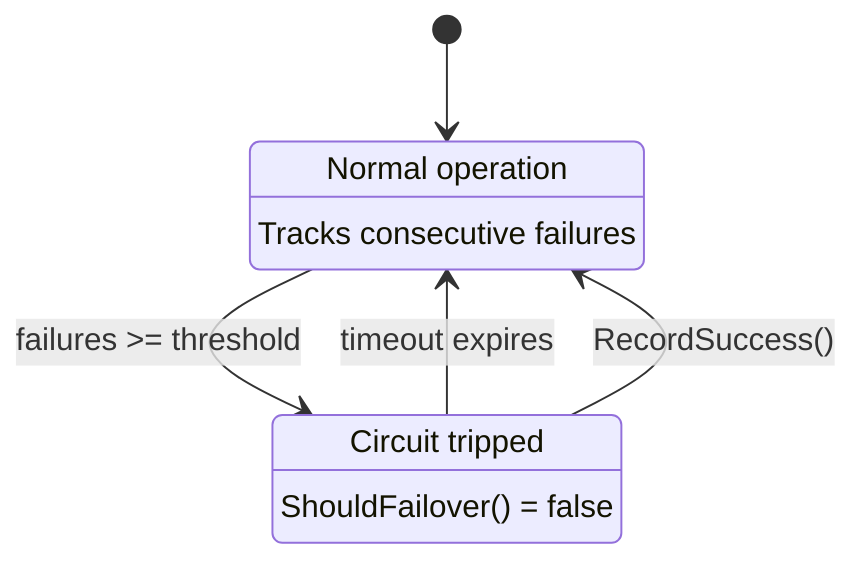

# Strategy and Policy Interaction

This document explains how `ReadStrategy`, `WriteStrategy`, and `FailoverPolicy` interact within Helix to provide robust dual-cluster operations.

## Overview

Helix separates concerns into three distinct interfaces:

| Interface | Responsibility | Example Implementations |
|-----------|----------------|------------------------|
| **ReadStrategy** | Where to route reads, how to failover | `StickyRead`, `RoundRobinRead`, `PrimaryOnlyRead` |
| **WriteStrategy** | How to execute writes across clusters | `ConcurrentDualWrite`, `SyncDualWrite`, `AdaptiveDualWrite` |
| **FailoverPolicy** | When failover is allowed (circuit breaker) | `ActiveFailover`, `CircuitBreaker`, `LatencyCircuitBreaker` |

## Read Path Architecture

```
┌─────────────────────────────────────────────────────────────────────┐
│                        CQLClient.executeRead()                      │
├─────────────────────────────────────────────────────────────────────┤
│                                                                     │
│  1. ReadStrategy.Select(ctx) → selectedCluster                      │
│                                                                     │
│  2. Execute read on selectedCluster                                 │
│                                                                     │
│  3. On SUCCESS:                                                     │
│     ├─ ReadStrategy.OnSuccess(cluster)                              │
│     └─ FailoverPolicy.RecordSuccess(cluster)                        │
│                                                                     │
│  4. On FAILURE:                                                     │
│     ├─ FailoverPolicy.RecordFailure(cluster)                        │
│     │                                                               │
│     ├─ FailoverPolicy.ShouldFailover(cluster, err)  ← GATEKEEPER    │
│     │   └─ If FALSE → return error immediately                      │
│     │                                                               │
│     └─ ReadStrategy.OnFailure(cluster, err) → alternative, ok       │
│         └─ If ok → try alternative cluster                          │
│                                                                     │
└─────────────────────────────────────────────────────────────────────┘
```

### Key Design Decisions

1. **FailoverPolicy is a Gatekeeper**: It must approve failover before `ReadStrategy.OnFailure` is even consulted. This prevents:
   - Circuit breaker logic from being bypassed
   - Unnecessary cluster switches on transient errors

2. **ReadStrategy Controls Routing**: It decides:
   - Which cluster to try first (`Select`)
   - Where to go on failover (`OnFailure`)
   - When to switch preferred cluster (via internal cooldown)

3. **Both Can Deny Failover**:
   - If `FailoverPolicy.ShouldFailover()` returns `false` → no failover
   - If `ReadStrategy.OnFailure()` returns `false` → no failover (e.g., cooldown active)

## Configuration Examples

### Aggressive Failover (Default)

Immediately failover on any error. Suitable for read-heavy workloads where availability is paramount.

```go
client, _ := helix.NewCQLClient(sessionA, sessionB,
    helix.WithReadStrategy(policy.NewStickyRead(
        policy.WithStickyReadCooldown(5*time.Minute), // Prevent flapping
    )),
    helix.WithFailoverPolicy(policy.NewActiveFailover()), // Always allow failover
)
```

**Behavior**: On first error, immediately try alternative cluster. After switching, wait 5 minutes before switching again.

### Conservative Failover (Circuit Breaker)

Only failover after multiple consecutive failures. Suitable for workloads that can tolerate occasional errors.

```go
client, _ := helix.NewCQLClient(sessionA, sessionB,
    helix.WithReadStrategy(policy.NewStickyRead(
        policy.WithStickyReadCooldown(5*time.Minute),
    )),
    helix.WithFailoverPolicy(policy.NewCircuitBreaker(
        policy.WithThreshold(3),           // 3 failures before failover
        policy.WithResetTimeout(30*time.Second), // Reset counter after 30s idle
    )),
)
```

**Behavior**: First 2 errors return immediately (no failover). On 3rd consecutive error, failover is allowed. After 30 seconds of no failures, counter resets.

### No Failover (Single Preference)

Always read from one cluster, never failover. Suitable for read-after-write consistency scenarios.

```go
client, _ := helix.NewCQLClient(sessionA, sessionB,
    helix.WithReadStrategy(policy.NewStickyRead(
        policy.WithPreferredCluster(helix.ClusterA),
        policy.WithStickyReadCooldown(time.Hour), // Effectively disable switching
    )),
    // No FailoverPolicy = failover blocked at strategy level
)
```

## Write Path Architecture

```
┌─────────────────────────────────────────────────────────────────────┐
│                  CQLClient.executeWriteWithReplay()                 │
├─────────────────────────────────────────────────────────────────────┤
│                                                                     │
│  1. WriteStrategy.Execute(ctx, writeA, writeB)                      │
│     ├─ ConcurrentDualWrite: Both clusters in parallel               │
│     └─ AdaptiveDualWrite: Fast cluster first, slow cluster async    │
│                                                                     │
│  2. Results:                                                        │
│     ├─ Both succeed → return nil                                    │
│     ├─ Both fail → return DualClusterError                          │
│     └─ One fails → enqueue to Replayer, return nil                  │
│                                                                     │
└─────────────────────────────────────────────────────────────────────┘
```

### WriteStrategy Implementations

| Strategy | Behavior | Best For |
|----------|----------|----------|
| `ConcurrentDualWrite` | Execute both writes in parallel, wait for both | Maximum consistency |
| `SyncDualWrite` | Execute writes sequentially (A then B, or B then A) | Debugging, strict ordering |
| `AdaptiveDualWrite` | Latency-aware: healthy clusters wait, degraded clusters fire-and-forget | Latency-sensitive workloads |

#### AdaptiveDualWrite Details

The `AdaptiveDualWrite` strategy monitors relative cluster performance and adapts behavior:

```
┌─────────────────────────────────────────────────────────────────────┐
│                     AdaptiveDualWrite Logic                         │
├─────────────────────────────────────────────────────────────────────┤
│                                                                     │
│  For each cluster (A and B):                                        │
│                                                                     │
│  1. HEALTHY state (default):                                        │
│     └─ Wait for write completion, record latency                    │
│                                                                     │
│  2. Transition to DEGRADED when:                                    │
│     ├─ Latency > absoluteMax (default: 2s), OR                      │
│     └─ Consistently slower than sibling by > deltaThreshold         │
│        (default: 300ms) for strikeThreshold writes (default: 3)     │
│                                                                     │
│  3. DEGRADED state:                                                 │
│     └─ Fire-and-forget (don't block), rely on replay for failures   │
│                                                                     │
│  4. Recovery to HEALTHY when:                                       │
│     └─ recoveryThreshold (default: 5) consecutive fast writes       │
│                                                                     │
│  Note: Delta comparisons ignored if both clusters < minFloor (100ms)│
│                                                                     │
└─────────────────────────────────────────────────────────────────────┘
```

**Configuration Options:**

```go
strategy := policy.NewAdaptiveDualWrite(
    policy.WithAdaptiveDeltaThreshold(300 * time.Millisecond), // Relative difference threshold
    policy.WithAdaptiveAbsoluteMax(2 * time.Second),           // Absolute latency cap
    policy.WithAdaptiveMinFloor(100 * time.Millisecond),       // Ignore delta if both faster
    policy.WithAdaptiveStrikeThreshold(3),                     // Slow writes before degraded
    policy.WithAdaptiveRecoveryThreshold(5),                   // Fast writes to recover
    policy.WithAdaptiveFireForgetTimeout(30 * time.Second),    // Timeout for background writes
)
```

## Cooldown Explained

The `StickyRead` strategy has an internal cooldown to prevent "flapping" between clusters:

```
Time →
├─────────────────────────────────────────────────────────────────────┤
│ Cluster A (preferred)     │ Cluster B (after failover)              │
├───────────────────────────┼─────────────────────────────────────────┤
│ ██████████████████████████│░░░░░░░░░░░░░░░░░░░░░░░░░░░░░░░░░░░░░░░░░│
│ Normal reads              │ Reads after A fails                     │
│                           │                                         │
│ ← Error occurs            │ ← Failover to B                         │
│                           │ ← Cooldown starts (5 min)               │
│                           │                                         │
│                           │ During cooldown: B is preferred         │
│                           │ Even if B has errors, stays on B        │
│                           │                                         │
│                           │ After cooldown: Can switch back to A    │
└───────────────────────────┴─────────────────────────────────────────┘
```

Configure cooldown via `policy.WithStickyReadCooldown(duration)`.

## ReadStrategy Implementations

| Strategy | Description | Use Case |
|----------|-------------|----------|
| `StickyRead` | Randomly picks initial cluster, sticks to it with failover cooldown | Default, cache-friendly |
| `RoundRobinRead` | Alternates between clusters on each read | Even load distribution |
| `PrimaryOnlyRead` | Always reads from Cluster A, fails over to B once on error | Strong consistency preference |

### StickyRead (Default)

The default read strategy optimizes for cache locality by "sticking" to one cluster:

```go
// Basic usage (random initial cluster)
strategy := policy.NewStickyRead()

// With preferred cluster
strategy := policy.NewStickyRead(
    policy.WithPreferredCluster(helix.ClusterA),
)

// With custom cooldown (default: 5 minutes)
strategy := policy.NewStickyRead(
    policy.WithStickyReadCooldown(10 * time.Minute),
)
```

**Behavior:**
- On creation: Randomly selects initial cluster (or uses preferred if set)
- On read error: Switches to other cluster, starts cooldown timer
- During cooldown: Stays on current cluster even if it has errors
- After cooldown: Can switch back if current cluster fails

### RoundRobinRead

Alternates between clusters on each read for even load distribution:

```go
strategy := policy.NewRoundRobinRead()
```

**Behavior:**
- First read goes to Cluster A, second to B, third to A, etc.
- Uses atomic counter for thread-safe alternation
- No failover logic built-in (relies on FailoverPolicy)

### PrimaryOnlyRead

Always reads from Cluster A, with single failover to B on error:

```go
strategy := policy.NewPrimaryOnlyRead()

// After recovery, reset to prefer A again
strategy.Reset()
```

**Behavior:**
- Normal operation: All reads go to Cluster A
- On A error: Fails over to Cluster B for that request only
- Subsequent reads: Continue trying A first
- Use `Reset()` after cluster A recovery

## FailoverPolicy Implementations

| Policy | Description | Use Case |
|--------|-------------|----------|
| `ActiveFailover` | Always allows failover (no circuit breaker) | Maximum availability |
| `CircuitBreaker` | Opens after N failures, auto-closes after timeout | Prevent cascade failures |
| `LatencyCircuitBreaker` | CircuitBreaker + treats slow responses as soft failures | Latency-sensitive workloads |

### ActiveFailover (Default)

A no-op policy that always allows failover:

```go
policy := policy.NewActiveFailover()
```

**Behavior:**
- `ShouldFailover()` always returns `true`
- `RecordFailure()` and `RecordSuccess()` are no-ops
- Use when you want maximum read availability

### CircuitBreaker

Threshold-based circuit breaker that opens after consecutive failures:

```go
breaker := policy.NewCircuitBreaker(
    policy.WithCircuitThreshold(3),              // Failures before opening (default: 3)
    policy.WithCircuitResetTimeout(30*time.Second), // Auto-close after timeout (default: 30s)
    policy.WithCircuitLogger(logger),            // Optional structured logging
)
```

**State Machine:**


**Behavior:**
- CLOSED (normal): Tracks consecutive failures per cluster
- OPEN (tripped): `ShouldFailover()` returns `false`, preventing cascade
- Auto-recovery: After `resetTimeout`, circuit auto-closes
- Logging: Logs "circuit breaker tripped" and "circuit breaker closed" events

### LatencyCircuitBreaker

Extends `CircuitBreaker` with latency awareness:

```go
breaker := policy.NewLatencyCircuitBreaker(
    policy.WithLatencyAbsoluteMax(2 * time.Second), // Latencies above this count as failures
    policy.WithLatencyThreshold(3),
    policy.WithLatencyResetTimeout(30*time.Second),
)
```

**Automatic Integration:**

The client automatically detects policies implementing `LatencyRecorder` interface and calls
`RecordLatency()` after each successful read operation. No manual integration required.

```go
// LatencyRecorder is automatically detected - just configure and use
client, _ := helix.NewCQLClient(
    ctx,
    sessionA, sessionB,
    helix.WithFailoverPolicy(breaker),
)
// Latency is recorded automatically on each read!
```

**Behavior:**
- Inherits all `CircuitBreaker` behavior
- `RecordLatency()`: If latency > absoluteMax, calls `RecordFailure()` internally
- **Auto-integrated**: Client calls `RecordLatency()` automatically after successful reads
- Treats consistently slow clusters as "soft failures"
- Use `AbsoluteMax()` getter to inspect the configured threshold

## Operation Timeouts

Timeouts for CQL operations should be configured on the underlying gocql session, not at the Helix level.

### gocql Session Timeout Configuration

```go
// Configure timeout at the gocql cluster level
cluster := gocql.NewCluster("host1", "host2")
cluster.Timeout = 5 * time.Second  // Per-query timeout at driver level

session, _ := cluster.CreateSession()
```

### Why Session-Level Timeouts?

1. **Driver-native**: gocql handles timeouts internally with proper cleanup
2. **Simpler**: No context wrapping overhead
3. **Consistent**: Same behavior for all query types (reads, writes, batches)

### Timeout Best Practices

1. **Set gocql timeout based on your SLA**: 2-10 seconds for interactive workloads
2. **Consider network latency**: Cross-datacenter adds 50-200ms
3. **Account for retries**: gocql retries within the timeout budget

## Best Practices

1. **Always Configure Both Strategy and Policy**: They serve different purposes.
   - Strategy = routing logic
   - Policy = circuit breaker / resilience logic

2. **Set Reasonable Cooldowns**:
   - Too short (< 1 min): Risk of flapping
   - Too long (> 10 min): Slow recovery when cluster comes back

3. **Match Policy to Workload**:
   - High-availability reads: `ActiveFailover`
   - Tolerate occasional errors: `CircuitBreaker` with threshold 3-5
   - Read-after-write: Disable failover entirely

4. **Monitor Failover Events**: Implement observability to track:
   - `FailoverPolicy.RecordFailure/RecordSuccess` calls
   - Cluster switches in `ReadStrategy`
